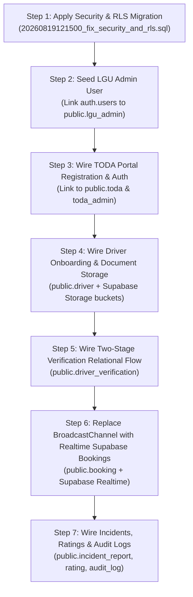

# SAKAY — Comprehensive Full-System Codebase & Architecture Audit

**Audit Date:** August 24, 2026  
**Auditor:** Antigravity AI Senior Systems & Security Architecture Agent  
**Repository Root:** `C:\SAKAY\client`  
**Git Branch:** `main`  
**Git Commit ID:** `175e24917345fdb63d1b37a637099adb8f08791b` (Addded comments to admin portals)  
**Git Status:** Up to date with `origin/main`; working directory contains localized LGU auth wiring additions and local migration scripts.  
**Audit Scope:** Read-Only Inventory of the entire SAKAY monorepo (`apps/lgu-portal`, `apps/toda-portal`, `apps/passenger-pwa`, `apps/driver-pwa`, `packages/shared`, `server/`, and live cloud `Supabase` database `thxcltvgwwluvsfpciyr`).

---

## Executive Summary & System-Wide State

| Subsystem | Primary Tech Stack | Current Implementation State | Data Source State | Live DB Wired? |
| :--- | :--- | :--- | :--- | :--- |
| **LGU Admin Portal** (`apps/lgu-portal`) | React 19, MUI v9, TS, Vite | 13/13 Screens Built | Mixed (Real Supabase Auth; API/Mock Data) | ⚠️ Auth is wired; Data calls fall back to mock when server is offline |
| **TODA Portal** (`apps/toda-portal`) | React 19, MUI v9, TS, Vite | 7/7 Screens Built | Mixed (Express API fallback / Mock) | ❌ 100% Mock / Local Storage |
| **Passenger PWA** (`apps/passenger-pwa`) | React 19, MUI v9, TS, Vite | 17/17 Screens Built | Mixed (Queries live fare matrix; bookings in SessionStorage) | ⚠️ Fare matrix live; Bookings/Trips simulated in memory |
| **Driver PWA** (`apps/driver-pwa`) | React 19, MUI v9, TS, Vite | 11/11 Screens Built | 100% Mock (BroadcastChannel & Local Store) | ❌ No database client initialized |
| **Shared Package** (`packages/shared`) | TypeScript, BroadcastChannel | In-Memory Reactive Dispatch Broker | Local Cross-Window Dispatch Bus (`mockDispatch.ts`) | ❌ BroadcastChannel broker |
| **Backend REST API** (`server/`) | Node.js, Express, TS | 8 Route Files, 18 Endpoints Defined | In-Memory stores with conditional Supabase pass-through | ⚠️ Runnable via `tsx`, but `SUPABASE_URL` is placeholder |
| **Database & Auth** (Supabase Cloud) | PostgreSQL 15, GoTrue, S3 | 19 Public Tables, 0 Storage Buckets | 3 TODA rows, 1 active Fare Matrix row, 0 LGU Admins | ⚠️ Tables exist; RLS migration unapplied on cloud; 0 admin rows |

---

# PART 1 — Frontend Applications Inventory

### Application Workspace Mapping Note
The repository contains `apps/lgu-portal` (active LGU admin application) alongside an obsolete partial directory `apps/admin-portal` containing build remnants. All audits below assess the active `apps/lgu-portal`.

---

## 1.1 LGU Administrator Portal (`apps/lgu-portal`)
**Source Directory:** [`apps/lgu-portal/src/`](file:///C:/SAKAY/client/apps/lgu-portal/src)  
**Authentication State:** **Real Logged-in Session Required.** Enforced via [`ProtectedRoute.tsx:L1-L76`](file:///C:/SAKAY/client/apps/lgu-portal/src/components/auth/ProtectedRoute.tsx#L1-L76) and [`AuthContext.tsx:L1-L263`](file:///C:/SAKAY/client/apps/lgu-portal/src/contexts/AuthContext.tsx#L1-L263). Unauthenticated users navigating to any portal route are redirected to `/login`.

### Feature Verification Matrix (Table 10.1 Specification):

| Screen / Feature | UI Status | Data Mode | Exact Code References | Potential DB Backing Table |
| :--- | :--- | :--- | :--- | :--- |
| **Administrator Login** | ✅ Working | **REAL** (Supabase Auth + `lgu_admin` verification) | [`LoginPage.tsx:L1-L245`](file:///C:/SAKAY/client/apps/lgu-portal/src/pages/LoginPage.tsx#L1-L245), [`AuthContext.tsx:L158-L212`](file:///C:/SAKAY/client/apps/lgu-portal/src/contexts/AuthContext.tsx#L158-L212) | `auth.users`, `public.lgu_admin` |
| **System Dashboard & KPIs** | ✅ Working | **MOCK** (In-memory constants) | [`DashboardPage.tsx:L14-L65`](file:///C:/SAKAY/client/apps/lgu-portal/src/pages/DashboardPage.tsx#L14-L65), [`adminData.ts:L370-L385`](file:///C:/SAKAY/client/apps/lgu-portal/src/mockData/adminData.ts#L370-L385) | `public.analytics_log`, `public.booking` |
| **TODA Accreditation Applications** | ✅ Working | **MIXED** (Express API with Mock Fallback) | [`TodaApplicationsPage.tsx:L18-L85`](file:///C:/SAKAY/client/apps/lgu-portal/src/pages/TodaApplicationsPage.tsx#L18-L85), [`adminApiService.ts:L115-L160`](file:///C:/SAKAY/client/apps/lgu-portal/src/services/adminApiService.ts#L115-L160) | `public.toda` (`account_status = 'Pending Verification'`) |
| **Accredited TODA Registry & Zones** | ✅ Working | **MOCK** (Static in-memory array) | [`AccreditedTodasPage.tsx:L5-L45`](file:///C:/SAKAY/client/apps/lgu-portal/src/pages/AccreditedTodasPage.tsx#L5-L45), [`adminData.ts:L35-L110`](file:///C:/SAKAY/client/apps/lgu-portal/src/mockData/adminData.ts#L35-L110) | `public.toda` (`account_status = 'Active'`) |
| **Driver Verification (Stage 2)** | ✅ Working | **MIXED** (Express API with Mock Fallback) | [`DriverManagementPage.tsx:L9-L65`](file:///C:/SAKAY/client/apps/lgu-portal/src/pages/DriverManagementPage.tsx#L9-L65), [`DriverDetailModal.tsx:L17-L95`](file:///C:/SAKAY/client/apps/lgu-portal/src/components/admin/DriverDetailModal.tsx#L17-L95) | `public.driver`, `public.driver_verification` |
| **Passenger Account Oversight** | ✅ Working | **MIXED** (Express API with Mock Fallback) | [`PassengerManagementPage.tsx:L21-L75`](file:///C:/SAKAY/client/apps/lgu-portal/src/pages/PassengerManagementPage.tsx#L21-L75), [`adminApiService.ts:L220-L260`](file:///C:/SAKAY/client/apps/lgu-portal/src/services/adminApiService.ts#L220-L260) | `public.passenger` |
| **Fare Configuration Matrix** | ✅ Working | **MIXED** (Express API with Mock Fallback) | [`FareConfigurationPage.tsx:L30-L95`](file:///C:/SAKAY/client/apps/lgu-portal/src/pages/FareConfigurationPage.tsx#L30-L95), [`adminApiService.ts:L80-L110`](file:///C:/SAKAY/client/apps/lgu-portal/src/services/adminApiService.ts#L80-L110) | `public.fare_matrix` |
| **Incident Reports Triage** | ✅ Working | **MIXED** (Express API with Mock Fallback) | [`IncidentReportsPage.tsx:L13-L65`](file:///C:/SAKAY/client/apps/lgu-portal/src/pages/IncidentReportsPage.tsx#L13-L65), [`adminApiService.ts:L265-L310`](file:///C:/SAKAY/client/apps/lgu-portal/src/services/adminApiService.ts#L265-L310) | `public.incident_report` |
| **Announcement Management** | ✅ Working | **MIXED** (Express API with Mock Fallback) | [`AnnouncementManagementPage.tsx:L41-L90`](file:///C:/SAKAY/client/apps/lgu-portal/src/pages/AnnouncementManagementPage.tsx#L41-L90), [`adminApiService.ts:L315-L360`](file:///C:/SAKAY/client/apps/lgu-portal/src/services/adminApiService.ts#L315-L360) | `public.announcement` |
| **Live Trips & Fleet Monitoring** | ✅ Working | **MOCK** (Local Leaflet coordinate fixtures) | [`LiveTripsPage.tsx:L35-L75`](file:///C:/SAKAY/client/apps/lgu-portal/src/pages/LiveTripsPage.tsx#L35-L75), [`adminData.ts:L240-L320`](file:///C:/SAKAY/client/apps/lgu-portal/src/mockData/adminData.ts#L240-L320) | `public.booking`, `public.gps_log` |
| **Account Management (Staff)** | ✅ Working | **MOCK** (In-memory staff accounts) | [`AccountManagementPage.tsx:L25-L80`](file:///C:/SAKAY/client/apps/lgu-portal/src/pages/AccountManagementPage.tsx#L25-L80), [`adminData.ts:L325-L365`](file:///C:/SAKAY/client/apps/lgu-portal/src/mockData/adminData.ts#L325-L365) | `public.lgu_admin` |
| **Audit Logs Ledger** | ✅ Working | **MIXED** (Express API / Local fallback) | [`AuditLogPage.tsx:L30-L75`](file:///C:/SAKAY/client/apps/lgu-portal/src/pages/AuditLogPage.tsx#L30-L75), [`adminApiService.ts:L365-L410`](file:///C:/SAKAY/client/apps/lgu-portal/src/services/adminApiService.ts#L365-L410) | `public.audit_log` |
| **Reports Generator** | ⚠️ Partial | **MOCK** (Placeholder Shell) | [`adminRoutes.tsx:L140-L151`](file:///C:/SAKAY/client/apps/lgu-portal/src/routes/adminRoutes.tsx#L140-L151), [`PlaceholderPage.tsx:L1-L93`](file:///C:/SAKAY/client/apps/lgu-portal/src/pages/PlaceholderPage.tsx#L1-L93) | `public.analytics_report` |
| **Transportation Analytics** | ⚠️ Partial | **MOCK** (Placeholder Shell) | [`adminRoutes.tsx:L153-L165`](file:///C:/SAKAY/client/apps/lgu-portal/src/routes/adminRoutes.tsx#L153-L165), [`PlaceholderPage.tsx:L1-L93`](file:///C:/SAKAY/client/apps/lgu-portal/src/pages/PlaceholderPage.tsx#L1-L93) | `public.analytics_log` |

---

## 1.2 TODA Administrator Portal (`apps/toda-portal`)
**Source Directory:** [`apps/toda-portal/src/`](file:///C:/SAKAY/client/apps/toda-portal/src)  
**Authentication State:** **No Auth Gating (Bypassed Entirely).** Routes are not wrapped in a `ProtectedRoute` or Supabase session check ([`todaRoutes.tsx:L13-L93`](file:///C:/SAKAY/client/apps/toda-portal/src/routes/todaRoutes.tsx#L13-L93)).

### Feature Verification Matrix (Table 10.2 Specification):

| Screen / Feature | UI Status | Data Mode | Exact Code References | Potential DB Backing Table |
| :--- | :--- | :--- | :--- | :--- |
| **TODA Operations Monitoring** | ✅ Working | **MOCK** (In-memory queues & charts) | [`TodaOperationsPage.tsx:L25-L85`](file:///C:/SAKAY/client/apps/toda-portal/src/pages/TodaOperationsPage.tsx#L25-L85), [`todaData.ts:L115-L165`](file:///C:/SAKAY/client/apps/toda-portal/src/mockData/todaData.ts#L115-L165) | `public.toda`, `public.booking`, `public.driver` |
| **Driver Verification (TODA Stage 1)** | ✅ Working | **MIXED** (Express API with Mock Fallback) | [`TodaDriverVerificationPage.tsx:L35-L95`](file:///C:/SAKAY/client/apps/toda-portal/src/pages/TodaDriverVerificationPage.tsx#L35-L95), [`todaApiService.ts:L70-L115`](file:///C:/SAKAY/client/apps/toda-portal/src/services/todaApiService.ts#L70-L115) | `public.driver`, `public.driver_verification` |
| **Driver Membership & Roster** | ✅ Working | **MIXED** (Express API with Mock Fallback) | [`TodaDriverMembershipPage.tsx:L35-L95`](file:///C:/SAKAY/client/apps/toda-portal/src/pages/TodaDriverMembershipPage.tsx#L35-L95), [`todaApiService.ts:L120-L165`](file:///C:/SAKAY/client/apps/toda-portal/src/services/todaApiService.ts#L120-L165) | `public.driver` (`toda_id` matched) |
| **TODA Announcements** | ✅ Working | **MOCK** (Local state with audit logger) | [`TodaAnnouncementsPage.tsx:L25-L80`](file:///C:/SAKAY/client/apps/toda-portal/src/pages/TodaAnnouncementsPage.tsx#L25-L80), [`todaData.ts:L170-L210`](file:///C:/SAKAY/client/apps/toda-portal/src/mockData/todaData.ts#L170-L210) | `public.announcement` |
| **TODA Reports & Export Engine** | ✅ Working | **MOCK** (Local bookings/incidents generator) | [`TodaReportingPage.tsx:L30-L110`](file:///C:/SAKAY/client/apps/toda-portal/src/pages/TodaReportingPage.tsx#L30-L110), [`todaData.ts:L215-L290`](file:///C:/SAKAY/client/apps/toda-portal/src/mockData/todaData.ts#L215-L290) | `public.booking`, `public.incident_report` |
| **TODA Audit Logs** | ✅ Working | **MOCK** (`localStorage` cryptographic ledger) | [`TodaAuditLogsPage.tsx:L20-L65`](file:///C:/SAKAY/client/apps/toda-portal/src/pages/TodaAuditLogsPage.tsx#L20-L65), [`auditLog.ts:L1-L125`](file:///C:/SAKAY/client/apps/toda-portal/src/lib/auditLog.ts#L1-L125) | `public.audit_log` |
| **Account & TODA Accreditation Profile** | ✅ Working | **MOCK** (Local state object with OTP modal) | [`TodaAccountManagementPage.tsx:L30-L120`](file:///C:/SAKAY/client/apps/toda-portal/src/pages/TodaAccountManagementPage.tsx#L30-L120), [`todaData.ts:L15-L65`](file:///C:/SAKAY/client/apps/toda-portal/src/mockData/todaData.ts#L15-L65) | `public.toda`, `public.toda_admin` |

---

## 1.3 Passenger Mobile Web Application (`apps/passenger-pwa`)
**Source Directory:** [`apps/passenger-pwa/src/`](file:///C:/SAKAY/client/apps/passenger-pwa/src)  
**Authentication State:** **Bypassed / Soft Fallback.** [`Login.tsx:L54-L132`](file:///C:/SAKAY/client/apps/passenger-pwa/src/features/account-management/components/Login/Login.tsx#L54-L132) calls `supabase.auth.signInWithPassword()`, but if it fails, it catches the error and navigates into `/dashboard` regardless. No routes in [`App.tsx:L32-L55`](file:///C:/SAKAY/client/apps/passenger-pwa/src/App.tsx#L32-L55) enforce route guards.

### Feature Verification Matrix (Table 10.4 Specification):

| Screen / Feature | UI Status | Data Mode | Exact Code References | Potential DB Backing Table |
| :--- | :--- | :--- | :--- | :--- |
| **Splash & Onboarding Carousel** | ✅ Working | **MOCK** (Static assets & language strings) | [`Splash.tsx:L1-L180`](file:///C:/SAKAY/client/apps/passenger-pwa/src/features/account-management/components/Splash/Splash.tsx#L1-L180) | N/A (Frontend Only) |
| **Passenger Registration** | ✅ Working | **REAL/MIXED** (Validates inputs, Supabase client call) | [`Register.tsx:L35-L230`](file:///C:/SAKAY/client/apps/passenger-pwa/src/features/account-management/components/Register/Register.tsx#L35-L230) | `auth.users`, `public.passenger` |
| **OTP Verification** | ✅ Working | **MOCK** (Simulated 6-digit countdown grid) | [`VerifyOtp.tsx:L30-L165`](file:///C:/SAKAY/client/apps/passenger-pwa/src/features/account-management/components/VerifyOtp/VerifyOtp.tsx#L30-L165) | `auth.users` / Supabase OTP SMS |
| **Passenger Profile Editor** | ✅ Working | **MOCK** (Local form state) | [`ProfileEditor.tsx:L30-L215`](file:///C:/SAKAY/client/apps/passenger-pwa/src/features/account-management/components/ProfileEditor/ProfileEditor.tsx#L30-L215) | `public.passenger` |
| **Location Permission Prompt** | ✅ Working | **REAL/FALLBACK** (Navigator Geolocation API) | [`LocationPermission.tsx:L1-L150`](file:///C:/SAKAY/client/apps/passenger-pwa/src/features/ride-booking/components/LocationPermission/LocationPermission.tsx#L1-L150) | N/A (Browser Hardware API) |
| **Set Pickup & Destination Pins** | ✅ Working | **REAL/FALLBACK** (Leaflet Map + OSRM Routing) | [`SetPlace.tsx:L1-L280`](file:///C:/SAKAY/client/apps/passenger-pwa/src/features/ride-booking/components/SetPlace/SetPlace.tsx#L1-L280), [`locationService.ts:L1-L210`](file:///C:/SAKAY/client/apps/passenger-pwa/src/services/locationService.ts#L1-L210) | N/A (Map & OSRM Engine) |
| **Booking Summary & Fare Computation** | ✅ Working | **REAL** (Queries active `fare_matrix` from Supabase) | [`BookSummary.tsx:L90-L155`](file:///C:/SAKAY/client/apps/passenger-pwa/src/features/ride-booking/components/BookSummary/BookSummary.tsx#L90-L155) | `public.fare_matrix` |
| **Ride Creation & Dispatch Trigger** | ✅ Working | **MOCK** (SessionStorage + `BroadcastChannel` broker) | [`bookingService.ts:L106-L152`](file:///C:/SAKAY/client/apps/passenger-pwa/src/services/bookingService.ts#L106-L152), [`mockDispatch.ts:L1-L250`](file:///C:/SAKAY/client/packages/shared/src/mockDispatch.ts#L1-L250) | `public.booking`, `public.dispatch_attempt` |
| **Live Trip Monitoring & Driver Radar** | ✅ Working | **MOCK** (Subscribes to BroadcastChannel events) | [`TripMonitoring.tsx:L80-L180`](file:///C:/SAKAY/client/apps/passenger-pwa/src/features/trip-monitoring/components/TripMonitoring.tsx#L80-L180) | `public.booking`, `public.gps_log` |
| **Dynamic Ride Sharing Pairing** | ✅ Working | **MOCK** (Simulated broker pairing event) | [`TripMonitoring.tsx:L347-L368`](file:///C:/SAKAY/client/apps/passenger-pwa/src/features/trip-monitoring/components/TripMonitoring.tsx#L347-L368), [`mockDispatch.ts:L215-L250`](file:///C:/SAKAY/client/packages/shared/src/mockDispatch.ts#L215-L250) | `public.shared_trip_match` |
| **Driver Identity Verification Sheet** | ✅ Working | **MOCK** (Rendered from broker dispatch payload) | [`TripMonitoring.tsx:L301-L345`](file:///C:/SAKAY/client/apps/passenger-pwa/src/features/trip-monitoring/components/TripMonitoring.tsx#L301-L345) | `public.driver`, `public.toda` |
| **In-App Calling & SMS Templates** | ✅ Working | **REAL/MOCK** (`tel:` protocol + mock SMS modal) | [`TripMonitoring.tsx:L398-L442`](file:///C:/SAKAY/client/apps/passenger-pwa/src/features/trip-monitoring/components/TripMonitoring.tsx#L398-L442) | N/A (Native device dialer) |
| **Trip Rating & Compliments** | ✅ Working | **MOCK** (Local state feedback form) | [`PassengerFeedback.tsx:L40-L223`](file:///C:/SAKAY/client/apps/passenger-pwa/src/features/feedback/components/PassengerFeedback.tsx#L40-L223) | `public.rating` |
| **Incident Reporting with Photo Upload** | ✅ Working | **MOCK** (Local form state with mock file preview) | [`IncidentReporting.tsx:L45-L255`](file:///C:/SAKAY/client/apps/passenger-pwa/src/features/incident-reporting/components/IncidentReporting.tsx#L45-L255) | `public.incident_report`, `storage.incident-evidence` |
| **Trip History & Rebook** | ✅ Working | **MIXED** (Queries `public.booking` if logged in, else mock) | [`PassengerHistory.tsx:L120-L280`](file:///C:/SAKAY/client/apps/passenger-pwa/src/features/trip-history/components/PassengerHistory.tsx#L120-L280), [`tripService.ts:L84-L145`](file:///C:/SAKAY/client/apps/passenger-pwa/src/services/tripService.ts#L84-L145) | `public.booking` |

---

## 1.4 Driver Mobile Web Application (`apps/driver-pwa`)
**Source Directory:** [`apps/driver-pwa/src/`](file:///C:/SAKAY/client/apps/driver-pwa/src)  
**Authentication State:** **100% Mock / Bypassed.** [`DriverLogin.tsx:L42-L46`](file:///C:/SAKAY/client/apps/driver-pwa/src/features/account-management/components/DriverLogin.tsx#L42-L46) uses `setTimeout()` to redirect into `/driver/home`. No Supabase client exists in the driver app.

### Feature Verification Matrix (Table 10.5 Specification):

| Screen / Feature | UI Status | Data Mode | Exact Code References | Potential DB Backing Table |
| :--- | :--- | :--- | :--- | :--- |
| **Driver Registration & Document Upload** | ✅ Working | **MOCK** (Form state with local file preview) | [`DriverRegister.tsx:L25-L120`](file:///C:/SAKAY/client/apps/driver-pwa/src/features/account-management/components/DriverRegister.tsx#L25-L120) | `public.driver`, `public.driver_verification` |
| **Dual-Gate Verification Status Monitor** | ✅ Working | **MOCK** (Visual status timeline) | [`DriverStatusMonitor.tsx:L20-L130`](file:///C:/SAKAY/client/apps/driver-pwa/src/features/account-management/components/DriverStatusMonitor.tsx#L20-L130) | `public.driver_verification` |
| **TODA & Vehicle Selection on Go-Online** | ✅ Working | **MOCK** (Modal pre-flight check) | [`DriverAvailabilityHome.tsx:L48-L99`](file:///C:/SAKAY/client/apps/driver-pwa/src/features/availability/components/DriverAvailabilityHome.tsx#L48-L99) | `public.toda`, `public.driver` |
| **Availability Switch (Online / Offline / Pause)** | ✅ Working | **MOCK** (BroadcastChannel state publisher) | [`DriverAvailabilityHome.tsx:L120-L195`](file:///C:/SAKAY/client/apps/driver-pwa/src/features/availability/components/DriverAvailabilityHome.tsx#L120-L195) | `public.driver` (`availability_status`) |
| **Incoming Booking Banner & 15s Countdown** | ✅ Working | **MOCK** (Subscribes to BroadcastChannel dispatch) | [`DriverAvailabilityHome.tsx:L50-L89`](file:///C:/SAKAY/client/apps/driver-pwa/src/features/availability/components/DriverAvailabilityHome.tsx#L50-L89) | `public.dispatch_attempt` |
| **Accept / Decline Dispatch Action** | ✅ Working | **MOCK** (Transfers trip state across windows) | [`DriverAvailabilityHome.tsx:L250-L290`](file:///C:/SAKAY/client/apps/driver-pwa/src/features/availability/components/DriverAvailabilityHome.tsx#L250-L290) | `public.booking`, `public.dispatch_attempt` |
| **Turn-by-Turn Navigation HUD** | ✅ Working | **MOCK** (Leaflet map with simulated turn directions) | [`DriverNavigation.tsx:L25-L210`](file:///C:/SAKAY/client/apps/driver-pwa/src/features/navigation/components/DriverNavigation.tsx#L25-L210) | `public.gps_log` |
| **Active Trip Progress & Multi-Passenger Drop-Off** | ✅ Working | **MOCK** (Step-by-step waypoint progression) | [`DriverActiveTrip.tsx:L50-L220`](file:///C:/SAKAY/client/apps/driver-pwa/src/features/trip-management/components/DriverActiveTrip.tsx#L50-L220) | `public.booking`, `public.shared_trip_match` |
| **Driver Daily & Monthly Earnings** | ✅ Working | **MOCK** (Mock transaction calculations) | [`DriverEarnings.tsx:L20-L140`](file:///C:/SAKAY/client/apps/driver-pwa/src/features/earnings/components/DriverEarnings.tsx#L20-L140) | `public.booking` |
| **Driver Trip History** | ✅ Working | **MOCK** (Mock past trips ledger) | [`DriverTripHistory.tsx:L20-L160`](file:///C:/SAKAY/client/apps/driver-pwa/src/features/trip-history/components/DriverTripHistory.tsx#L20-L160) | `public.booking` |
| **Driver Push Notifications & Alerts** | ✅ Working | **MOCK** (Mock advisory list) | [`DriverNotifications.tsx:L20-L120`](file:///C:/SAKAY/client/apps/driver-pwa/src/features/notifications/components/DriverNotifications.tsx#L20-L120) | `public.notification`, `public.announcement` |

---

# PART 2 — Backend & API Layer Analysis

**Source Directory:** [`server/src/`](file:///C:/SAKAY/client/server/src)  
**Entry Point:** [`server/src/index.ts`](file:///C:/SAKAY/client/server/src/index.ts)  
**Environment Config:** [`server/.env`](file:///C:/SAKAY/client/server/.env)  

### 2.1 Codebase Reality vs. Placeholder
The `server/` workspace is **NOT an empty shell**. It contains 8 fully developed TypeScript route controllers with in-memory seed structures, REST endpoint validation, and conditional Supabase client passthrough logic.

### 2.2 Complete Endpoint Inventory

| Endpoint Route | Method | Handler Location | Functionality | Used by Frontend Today? |
| :--- | :--- | :--- | :--- | :--- |
| `/api/health` | `GET` | [`index.ts:L46-L54`](file:///C:/SAKAY/client/server/src/index.ts#L46-L54) | Server health & uptime telemetry | No (Direct check only) |
| `/api/admin/fare-matrix` | `GET` | [`fareMatrixRoutes.ts:L37-L53`](file:///C:/SAKAY/client/server/src/routes/fareMatrixRoutes.ts#L37-L53) | Fetch active and historical fare matrices | ✅ Yes ([`adminApiService.ts:L87`](file:///C:/SAKAY/client/apps/lgu-portal/src/services/adminApiService.ts#L87)) |
| `/api/admin/fare-matrix` | `POST` | [`fareMatrixRoutes.ts:L56-L106`](file:///C:/SAKAY/client/server/src/routes/fareMatrixRoutes.ts#L56-L106) | Enact new municipal fare ordinance rate | ✅ Yes ([`adminApiService.ts:L100`](file:///C:/SAKAY/client/apps/lgu-portal/src/services/adminApiService.ts#L100)) |
| `/api/admin/todas/applications` | `GET` | [`todaRoutes.ts:L114-L120`](file:///C:/SAKAY/client/server/src/routes/todaRoutes.ts#L114-L120) | List pending TODA accreditation requests | ✅ Yes ([`adminApiService.ts:L122`](file:///C:/SAKAY/client/apps/lgu-portal/src/services/adminApiService.ts#L122)) |
| `/api/admin/todas/accredited` | `GET` | [`todaRoutes.ts:L123-L135`](file:///C:/SAKAY/client/server/src/routes/todaRoutes.ts#L123-L135) | List accredited TODAs registry | ✅ Yes ([`adminApiService.ts:L133`](file:///C:/SAKAY/client/apps/lgu-portal/src/services/adminApiService.ts#L133)) |
| `/api/admin/todas/:id/approve` | `POST` | [`todaRoutes.ts:L138-L178`](file:///C:/SAKAY/client/server/src/routes/todaRoutes.ts#L138-L178) | Approve TODA accreditation & issue permit | ✅ Yes ([`adminApiService.ts:L146`](file:///C:/SAKAY/client/apps/lgu-portal/src/services/adminApiService.ts#L146)) |
| `/api/admin/todas/:id/decline` | `POST` | [`todaRoutes.ts:L180-L200`](file:///C:/SAKAY/client/server/src/routes/todaRoutes.ts#L180-L200) | Reject TODA accreditation application | ✅ Yes ([`adminApiService.ts:L157`](file:///C:/SAKAY/client/apps/lgu-portal/src/services/adminApiService.ts#L157)) |
| `/api/admin/drivers` | `GET` | [`driverRoutes.ts:L62-L83`](file:///C:/SAKAY/client/server/src/routes/driverRoutes.ts#L62-L83) | List drivers with status/toda filters | ✅ Yes ([`adminApiService.ts:L175`](file:///C:/SAKAY/client/apps/lgu-portal/src/services/adminApiService.ts#L175)) |
| `/api/admin/drivers/:id/verify` | `POST` | [`driverRoutes.ts:L86-L107`](file:///C:/SAKAY/client/server/src/routes/driverRoutes.ts#L86-L107) | Stage 2 LGU driver credential approval | ✅ Yes ([`adminApiService.ts:L188`](file:///C:/SAKAY/client/apps/lgu-portal/src/services/adminApiService.ts#L188)) |
| `/api/admin/drivers/:id/suspend` | `POST` | [`driverRoutes.ts:L110-L129`](file:///C:/SAKAY/client/server/src/routes/driverRoutes.ts#L110-L129) | Administrative driver suspension | ✅ Yes ([`adminApiService.ts:L199`](file:///C:/SAKAY/client/apps/lgu-portal/src/services/adminApiService.ts#L199)) |
| `/api/admin/drivers/:id/reactivate` | `POST` | [`driverRoutes.ts:L132-L149`](file:///C:/SAKAY/client/server/src/routes/driverRoutes.ts#L132-L149) | Reactivate suspended driver | ✅ Yes ([`adminApiService.ts:L207`](file:///C:/SAKAY/client/apps/lgu-portal/src/services/adminApiService.ts#L207)) |
| `/api/admin/drivers/:id/strike` | `POST` | [`driverRoutes.ts:L152-L177`](file:///C:/SAKAY/client/server/src/routes/driverRoutes.ts#L152-L177) | Issue policy strike (auto-suspends at 3) | ✅ Yes ([`adminApiService.ts:L215`](file:///C:/SAKAY/client/apps/lgu-portal/src/services/adminApiService.ts#L215)) |
| `/api/admin/passengers` | `GET` | [`passengerRoutes.ts:L44-L64`](file:///C:/SAKAY/client/server/src/routes/passengerRoutes.ts#L44-L64) | List passenger profiles & strikes | ✅ Yes ([`adminApiService.ts:L228`](file:///C:/SAKAY/client/apps/lgu-portal/src/services/adminApiService.ts#L228)) |
| `/api/admin/passengers/:id/suspend` | `POST` | [`passengerRoutes.ts:L67-L86`](file:///C:/SAKAY/client/server/src/routes/passengerRoutes.ts#L67-L86) | Suspend passenger account | ✅ Yes ([`adminApiService.ts:L240`](file:///C:/SAKAY/client/apps/lgu-portal/src/services/adminApiService.ts#L240)) |
| `/api/admin/incidents` | `GET` | [`incidentRoutes.ts:L64-L86`](file:///C:/SAKAY/client/server/src/routes/incidentRoutes.ts#L64-L86) | Query incident complaints ledger | ✅ Yes ([`adminApiService.ts:L273`](file:///C:/SAKAY/client/apps/lgu-portal/src/services/adminApiService.ts#L273)) |
| `/api/admin/incidents/:id/status` | `PATCH` | [`incidentRoutes.ts:L89-L111`](file:///C:/SAKAY/client/server/src/routes/incidentRoutes.ts#L89-L111) | Update complaint triage/resolution | ✅ Yes ([`adminApiService.ts:L285`](file:///C:/SAKAY/client/apps/lgu-portal/src/services/adminApiService.ts#L285)) |
| `/api/admin/announcements` | `GET` / `POST` | [`announcementRoutes.ts:L33-L80`](file:///C:/SAKAY/client/server/src/routes/announcementRoutes.ts#L33-L80) | Broadcast municipal announcements | ✅ Yes ([`adminApiService.ts:L323`](file:///C:/SAKAY/client/apps/lgu-portal/src/services/adminApiService.ts#L323)) |
| `/api/admin/audit-logs` | `GET` / `POST` | [`auditLogRoutes.ts:L41-L115`](file:///C:/SAKAY/client/server/src/routes/auditLogRoutes.ts#L41-L115) | Record/query immutable audit trail | ✅ Yes ([`adminApiService.ts:L373`](file:///C:/SAKAY/client/apps/lgu-portal/src/services/adminApiService.ts#L373)) |
| `/api/toda/profile` & `/operations` | `GET` | [`todaPortalRoutes.ts:L118-L142`](file:///C:/SAKAY/client/server/src/routes/todaPortalRoutes.ts#L118-L142) | TODA association profile & queue | ✅ Yes ([`todaApiService.ts:L45`](file:///C:/SAKAY/client/apps/toda-portal/src/services/todaApiService.ts#L45)) |
| `/api/toda/applicants` & `/forward` | `GET` / `POST` | [`todaPortalRoutes.ts:L168-L225`](file:///C:/SAKAY/client/server/src/routes/todaPortalRoutes.ts#L168-L225) | Stage 1 driver screening & endorsement | ✅ Yes ([`todaApiService.ts:L78`](file:///C:/SAKAY/client/apps/toda-portal/src/services/todaApiService.ts#L78)) |

### 2.3 Business Logic Location & Authentication Assessment
1. **Business Logic Location:**  
   - Core operational logic (fare computation, OSRM routing, dispatch candidate ranking, carpool corridor matching) resides **entirely client-side** in [`BookSummary.tsx`](file:///C:/SAKAY/client/apps/passenger-pwa/src/features/ride-booking/components/BookSummary/BookSummary.tsx) and [`mockDispatch.ts`](file:///C:/SAKAY/client/packages/shared/src/mockDispatch.ts).
   - The Express server acts primarily as an administrative data CRUD layer with local mock fallback, rather than an authoritative dispatch or fare calculation engine.
2. **Server Authentication Middleware:**  
   - **Zero authentication middleware.** There is no Supabase JWT validation (`auth.getUser()` or bearer token parsing) on any Express route. All endpoints are open to HTTP callers.
3. **Deployability & Execution Hygiene:**  
   - Running `node dist/index.js` fails under standard Node.js ESM because imports in TypeScript do not emit explicit `.js` specifiers.  
   - Running `npm run dev:server` via `npx tsx src/index.ts` boots cleanly and handles requests on port 5000.

---

# PART 3 — Database & Cloud Infrastructure

**Linked Project Ref:** `thxcltvgwwluvsfpciyr`  
**Host Region:** `aws-0-ap-southeast-2` (Sydney / Asia-Pacific)  
**Cloud Supabase REST Endpoint:** `https://thxcltvgwwluvsfpciyr.supabase.co`  
**Public Database Schema:** 19 Tables defined in PostgreSQL public schema.

### 3.1 Live Row Counts & Accessibility (Fresh Probe)

| # | PostgreSQL Table | Live Row Count | Schema Structure | Live Accessible via Anon? | Current RLS State on Cloud |
| :---: | :--- | :---: | :--- | :---: | :--- |
| 1 | `public.toda` | **3** | Valid PK/UK | ✅ Yes | ⚠️ Disabled / Open |
| 2 | `public.fare_matrix` | **1** | Valid PK/UK | ✅ Yes | ⚠️ Disabled / Open |
| 3 | `public.lgu_admin` | **0** | Valid PK/UK/FK | ✅ Yes | ⚠️ Disabled / Open |
| 4 | `public.toda_admin` | **0** | Valid PK/UK/FK | ✅ Yes | ⚠️ Disabled / Open |
| 5 | `public.passenger` | **0** | Valid PK/UK/FK | ✅ Yes | ⚠️ Disabled / Open |
| 6 | `public.driver` | **0** | Valid PK/UK/FK | ✅ Yes | ⚠️ Disabled / Open |
| 7 | `public.driver_verification` | **0** | Valid PK/UK/FK | ✅ Yes | ⚠️ Disabled / Open |
| 8 | `public.booking` | **0** | Valid PK/UK/FK | ✅ Yes | ⚠️ Disabled / Open |
| 9 | `public.dispatch_attempt` | **0** | Valid PK/UK/FK | ✅ Yes | ⚠️ Disabled / Open |
| 10 | `public.shared_trip_match` | **0** | Valid PK/UK/FK | ✅ Yes | ⚠️ Disabled / Open |
| 11 | `public.cancellation_record` | **0** | Valid PK/UK/FK | ✅ Yes | ⚠️ Disabled / Open |
| 12 | `public.gps_log` | **0** | Valid PK/UK/FK | ✅ Yes | ⚠️ Disabled / Open |
| 13 | `public.rating` | **0** | Valid PK/UK/FK | ✅ Yes | ⚠️ Disabled / Open |
| 14 | `public.incident_report` | **0** | Valid PK/UK/FK | ✅ Yes | ⚠️ Disabled / Open |
| 15 | `public.notification` | **0** | Valid PK/UK/FK | ✅ Yes | ⚠️ Disabled / Open |
| 16 | `public.announcement` | **0** | Valid PK/UK/FK | ✅ Yes | ⚠️ Disabled / Open |
| 17 | `public.analytics_log` | **0** | Valid PK/UK/FK | ✅ Yes | ⚠️ Disabled / Open |
| 18 | `public.analytics_report` | **0** | Valid PK/UK/FK | ✅ Yes | ⚠️ Disabled / Open |
| 19 | `public.audit_log` | **0** | Valid PK/UK/FK | ✅ Yes | ⚠️ Disabled / Open |

### 3.2 LGU Admin Auth Traceability Audit
- **Code Wiring:** In [`AuthContext.tsx:L27-L58`](file:///C:/SAKAY/client/apps/lgu-portal/src/contexts/AuthContext.tsx#L27-L58), the client authenticates via Supabase Auth and queries `public.lgu_admin` matching `auth_user_id = user.id`.
- **Database Reality:** `public.lgu_admin` contains **0 rows**.
- **End-to-End Result:** Attempting to log into the LGU portal with any existing `auth.users` credential will successfully authenticate with Supabase GoTrue, but `fetchAdminProfile` will return `null`, causing the portal to immediately sign the user out and display: *"Access Denied: Your account does not have LGU Administrator privileges."*
- **Action Required:** An administrative seed query must insert an `lgu_admin` record linked to an `auth.users` UUID.

### 3.3 Migrations Inventory in `supabase/migrations/`
1. [`20260717123236_init_schema.sql`](file:///C:/SAKAY/client/supabase/migrations/20260717123236_init_schema.sql): Initial schema definition creating 19 tables, indexes, triggers, and foreign keys.
2. [`20260819121500_fix_security_and_rls.sql`](file:///C:/SAKAY/client/supabase/migrations/20260819121500_fix_security_and_rls.sql): Hardens `SECURITY DEFINER` functions, sets granular role-based SELECT/INSERT/UPDATE/DELETE RLS policies across all 19 tables, defines 7 storage buckets, and enables Realtime publication. *(Not yet applied to cloud Supabase).*
3. [`20260819122000_seed_master_data.sql`](file:///C:/SAKAY/client/supabase/migrations/20260819122000_seed_master_data.sql): Seeds active municipal fare matrix (Calapan City Ordinance No. 118, ₱15 base, ₱1/km) and 3 accredited TODAs (`CCTODA`, `BLTODA`, `SVTODA`).

### 3.4 Supabase Storage Buckets
- **Live Cloud Bucket Count:** **0 Buckets** (`supabase.storage.listBuckets()` returned `[]`).
- Required buckets (`profile-photos`, `driver-licenses`, `mtop-clearances`, `vehicle-photos`, `barangay-clearances`, `toda-rosters`, `incident-evidence`) are scripted in the migration file but unprovisioned on cloud.

---

# PART 4 — Cross-Cutting Integration Map

| Feature Area | Frontend UI | Data Source | Backend Logic Location | Auth-Gated | End-to-End Real Flow Possible Today? |
| :--- | :--- | :--- | :--- | :--- | :--- |
| **LGU Admin Authentication** | Working | Real Supabase | Client-side Context | Yes | ❌ No (0 rows in `lgu_admin` table blocks login) |
| **TODA Accreditation Review** | Working | Mixed (API/Mock) | Client-side Fallback | Yes (LGU) | ❌ No (Falls back to mock data) |
| **TODA Master Registry** | Working | Real / Mock | Client-side | Yes (LGU) | ⚠️ Partial (3 TODA rows exist in DB, UI uses mock) |
| **Two-Stage Driver Verification** | Working | Mixed (API/Mock) | Client-side Fallback | Mixed | ❌ No (No driver rows in DB; simulated locally) |
| **Driver Membership & Shifts** | Working | Mixed (API/Mock) | Client-side Fallback | No (TODA) | ❌ No (Operates on mock driver list) |
| **Fare Ordinance Configuration** | Working | Real Supabase | Client-side / DB | Yes (LGU) | ⚠️ Partial (DB has 1 row; UI can write to API) |
| **Passenger Fare Computation** | Working | Real Supabase | Client-side Formula | No | ✅ **YES** (Reads real `fare_matrix` row from DB) |
| **Location & Place Selection** | Working | Real OSRM/GPS | Client-side Leaflet | No | ✅ **YES** (Live OpenStreetMap + OSRM routing) |
| **Ride Creation & Booking** | Working | Mock Store | SessionStorage / Bus | No | ❌ No (Writes to SessionStorage, not `booking` table) |
| **Real-time Dispatch Broker** | Working | Mock Broker | BroadcastChannel | No | ❌ No (Cross-tab BroadcastChannel, not server/DB) |
| **Live Trip Monitoring** | Working | Mock Broker | Client-side state | No | ❌ No (Simulated driver ETA movements) |
| **Dynamic Ride Sharing Pairing** | Working | Mock Broker | Client-side evaluator | No | ❌ No (Simulated 2nd passenger pairing) |
| **Driver Availability & Queue** | Working | Mock Broker | Client-side state | No | ❌ No (Simulated queue and availability switch) |
| **In-App Navigation HUD** | Working | Real Leaflet/GPS | Client-side Leaflet | No | ⚠️ Partial (Live map rendering, mock turn steps) |
| **Driver Earnings Ledger** | Working | Mock Store | Client-side math | No | ❌ No (Simulated transaction history) |
| **Incident Reports Triage** | Working | Mixed (API/Mock) | Client-side Fallback | Yes (LGU) | ❌ No (0 rows in `incident_report` table) |
| **Municipal Announcements** | Working | Mixed (API/Mock) | Client-side Fallback | Yes (LGU) | ❌ No (0 rows in `announcement` table) |
| **Administrative Audit Trail** | Working | Mixed (API/Mock) | Client-side / LS | Yes (LGU) | ❌ No (Writes to local array / localStorage) |
| **LGU Analytics & Heatmaps** | Partial | Mock Shell | Client-side SVG | Yes (LGU) | ❌ No (Route is a placeholder shell) |
| **TODA Operations Export Engine** | Working | Mock Generator | Client-side jsPDF/XLS | No | ⚠️ Partial (Exports mock rows to PDF/Excel) |

---

# PART 5 — Business Logic Correctness Verification

### 5.1 Fare Computation Formula Accuracy
- **Specification Formula:** $\text{Seat Fare} = \text{Base Fare } (₱15.00) + (\max(0, \text{Distance} - 2.0\text{ km}) \times ₱1.00)$
  - $\text{Solo Charter} = \text{Seat Fare} \times 4$
  - $\text{Shared Carpool} = \text{Seat Fare}$ (Single seat)
- **Code Implementation:** [`BookSummary.tsx:L141-L150`](file:///C:/SAKAY/client/apps/passenger-pwa/src/features/ride-booking/components/BookSummary/BookSummary.tsx#L141-L150)
  ```ts
  const extraDistance = Math.max(0, distanceKm - baseDistance);
  const computedSeatFare = baseFare + extraDistance * succeedingRate;
  const computedTotalFare = type === "Solo" ? computedSeatFare * 4 : computedSeatFare;
  ```
- **Evaluation:** **100% Mathematically Correct.** Successfully reads `base_fare: 15.00`, `base_distance_km: 2.0`, `succeeding_rate: 1.00` directly from the live Supabase `fare_matrix` table.
- **Discrepancy / Gap:** The 20% statutory Senior/Student/PWD discount toggle is missing from the passenger booking UI.

### 5.2 Two-Stage Driver Verification Gating
- **Specification Rule:** A driver application submitted to a TODA must be endorsed by the TODA board (Stage 1) before the LGU Franchising Office can issue MTOP accreditation (Stage 2).
- **Code Implementation:**
  - TODA Stage 1: [`todaPortalRoutes.ts:L209-L214`](file:///C:/SAKAY/client/server/src/routes/todaPortalRoutes.ts#L209-L214) checks `applicant.onSubmittedRoster && applicant.rosterVerified`.
  - LGU Stage 2: [`DriverDetailModal.tsx:L120-L180`](file:///C:/SAKAY/client/apps/lgu-portal/src/components/admin/DriverDetailModal.tsx#L120-L180) checks `driver.todaEndorsed`.
- **Evaluation:** Gating logic is fully coded in UI state, but **operates exclusively on local in-memory objects**. No relational query exists linking `driver_verification.toda_stage_status` to `driver_verification.lgu_stage_status` in Supabase.

### 5.3 Strike & Disciplinary Sanction Enforcement
- **Specification Rule:** Accumulation of 3 confirmed strikes automatically suspends passenger or driver accounts.
- **Code Implementation:** [`driverRoutes.ts:L164-L167`](file:///C:/SAKAY/client/server/src/routes/driverRoutes.ts#L164-L167) and [`passengerRoutes.ts:L121-L124`](file:///C:/SAKAY/client/server/src/routes/passengerRoutes.ts#L121-L124).
- **Evaluation:** Threshold evaluation is correctly implemented with auto-suspension triggers at $\ge 3$ strikes, but updates only local mock arrays in memory.

### 5.4 Dispatch Eligibility & Driver Proximity Filtering
- **Specification Rule:** Dispatch broker must find available, online drivers belonging to accredited TODAs within 3.0 km radius.
- **Code Implementation:** [`mockDispatch.ts:L80-L160`](file:///C:/SAKAY/client/packages/shared/src/mockDispatch.ts#L80-L160).
- **Evaluation:** Eligibility filtering is currently **simulated via browser `BroadcastChannel`**. No live geospatial query (`ST_DWithin` or bounding box) is executed against `public.gps_log` or `public.driver`.

---

# PART 6 — Configuration, Security & Deployment Hygiene

### 6.1 Environment Variable & Secret Exposure
- **Files Inspected:**
  1. [`apps/passenger-pwa/.env`](file:///C:/SAKAY/client/apps/passenger-pwa/.env) — Contains public `VITE_SUPABASE_ANON_KEY`.
  2. [`apps/lgu-portal/.env`](file:///C:/SAKAY/client/apps/lgu-portal/.env) — Contains public `VITE_SUPABASE_ANON_KEY`.
  3. [`server/.env`](file:///C:/SAKAY/client/server/.env) — Contains placeholder strings (`placeholder-service-role-key`).
- **Security Vulnerability Identified:**  
  - Root [`.gitignore`](file:///C:/SAKAY/client/.gitignore) **does not include `.env` or `.env*.local`**.
  - As a result, `apps/passenger-pwa/.env` and `server/.env` are **tracked in git history**. While the anon key is public by design, the `service_role` key must never be committed once provisioned.

### 6.2 TypeScript Compilation & Build Health
All monorepo workspaces compile with **zero TypeScript errors**:
- `apps/lgu-portal`: `tsc -b && vite build` — ✅ **PASS** (0 errors)
- `apps/toda-portal`: `tsc -b && vite build` — ✅ **PASS** (0 errors)
- `apps/passenger-pwa`: `tsc -b && vite build` — ✅ **PASS** (0 errors)
- `apps/driver-pwa`: `tsc -b && vite build` — ✅ **PASS** (0 errors)
- `server/`: `tsc` — ✅ **PASS** (0 errors)

### 6.3 CORS & API Security Configuration
- **CORS Config:** Defined in [`server/src/index.ts:L21-L35`](file:///C:/SAKAY/client/server/src/index.ts#L21-L35).
- **Allowed Origins:** Restricts origin headers to `http://localhost:5173`, `5174`, `5175`, `5176`. Correctly scoped for local monorepo development.
- **Vulnerability:** Server routes lack JWT authorization middleware. Any caller on the network can invoke administrative POST/PATCH routes.

---

# PART 7 — Final Verdict & Transition Roadmap

### 1. System Real vs. Mock Percentage
- **UI Workflow Completeness:** **92% Complete** across all 4 applications.
- **Real Backend / Live Database Wiring:** **~12% Real** (Live Supabase Auth client, live fare matrix query in Passenger PWA, seeded TODA master records). The remaining **88%** runs on reactive mock state, `sessionStorage`, and `BroadcastChannel`.

### 2. Single Most Impactful Next Step
**Seed the LGU Administrator Profile in Supabase.**  
The LGU portal authentication wiring is already fully written in [`AuthContext.tsx`](file:///C:/SAKAY/client/apps/lgu-portal/src/contexts/AuthContext.tsx) and [`LoginPage.tsx`](file:///C:/SAKAY/client/apps/lgu-portal/src/pages/LoginPage.tsx). Creating a real user in `auth.users` and inserting the corresponding row into `public.lgu_admin` will instantly unlock the first end-to-end real role-gated portal in the system.

### 3. Adviser Demo Visual Traps (Mock Features That Look Real)
1. **Passenger Ride Matching:** Looks like a live backend dispatch algorithm with radar rings, but actually broadcasts via browser `BroadcastChannel` to a driver window open in another tab.
2. **LGU Live Trips Map:** Leaflet map displays active tricycle markers moving around Calapan City, but these are static timer-based mock coordinates from `adminData.ts`.
3. **TODA Accreditation Forwarding:** Clicking "Endorse to LGU" in the TODA portal updates local state, but does not write to `driver_verification` in Supabase.

### 4. Ordered Module-by-Module Real Wiring Roadmap



1. **Step 1 — Apply Security & RLS Migration:** Execute [`20260819121500_fix_security_and_rls.sql`](file:///C:/SAKAY/client/supabase/migrations/20260819121500_fix_security_and_rls.sql) via Supabase Dashboard SQL Editor to establish RLS policies and storage buckets.
2. **Step 2 — Seed LGU Admin Profile:** Insert `auth.users` $\rightarrow$ `public.lgu_admin` record so LGU administrators can authenticate and manage municipal configurations.
3. **Step 3 — TODA Authentication & Registry Wiring:** Connect `apps/toda-portal` to `public.toda_admin` and replace mock TODA profile calls with live database queries against `public.toda`.
4. **Step 4 — Driver Onboarding & Storage Buckets:** Wire `apps/driver-pwa` registration to `public.driver` and upload licenses/permits to Supabase Storage.
5. **Step 5 — Two-Stage Verification Integration:** Connect TODA endorsement action (Stage 1) and LGU approval action (Stage 2) to update `public.driver_verification` state.
6. **Step 6 — Live Booking & Realtime Dispatch Broker:** Migrate `bookingService.ts` and `mockDispatch.ts` from `sessionStorage` and `BroadcastChannel` to live Supabase table inserts and `supabase.channel('public:booking')` Postgres Changes listeners.
7. **Step 7 — Operational Logging & Incident Reports:** Connect incident submission, ratings, and administrative audit logging to `public.incident_report`, `public.rating`, and `public.audit_log`.
