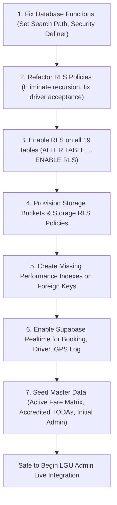

# SAKAY — Supabase Database Architecture & Security Audit
**Audit Date:** August 19, 2026  
**Audited Target:** Live Supabase Cloud Project (`thxcltvgwwluvsfpciyr`)  
**Scope:** Public Database Schema, Row Level Security (RLS), Supabase Auth Service, Supabase Storage, and Advisor Telemetry.  
**Audit Mode:** Read-Only Investigation (No schema modifications executed).

---

## 1. Confirm Access Level

### Supabase CLI & Project Link Status
- **Supabase CLI Project Link:** The repository contains a localized Supabase workspace under [`supabase/`](file:///C:/SAKAY/client/supabase).
- **Linked Project Ref:** `thxcltvgwwluvsfpciyr`
- **Project Name:** `SAKAY`
- **Organization Slug / ID:** `xvhziyzctxkbntejxwek`
- **Cloud Region:** `aws-0-ap-southeast-2` (Sydney / Asia-Pacific)
- **Local Configuration Files Inspected:**
  - [`supabase/config.toml`](file:///C:/SAKAY/client/supabase/config.toml) (`project_id = "sakay"`)
  - [`supabase/.temp/project-ref`](file:///C:/SAKAY/client/supabase/.temp/project-ref)
  - [`supabase/.temp/linked-project.json`](file:///C:/SAKAY/client/supabase/.temp/linked-project.json)
  - [`supabase/.temp/pooler-url`](file:///C:/SAKAY/client/supabase/.temp/pooler-url) (Pooler URL: `aws-0-ap-southeast-2.pooler.supabase.com:5432`)

### Environment Variable & Key Inventory (Names Only)
The codebase environment files contain the following keys (values masked in accordance with security policy):
1. [`apps/passenger-pwa/.env`](file:///C:/SAKAY/client/apps/passenger-pwa/.env) & [`.env.example`](file:///C:/SAKAY/client/apps/passenger-pwa/.env.example):
   - `VITE_SUPABASE_URL` (Points to `https://thxcltvgwwluvsfpciyr.supabase.co`)
   - `VITE_SUPABASE_ANON_KEY` (Live project public anon key)
   - `VITE_DEV_AUTH_BYPASS`
2. [`server/.env`](file:///C:/SAKAY/client/server/.env) & [`.env.example`](file:///C:/SAKAY/client/server/.env.example):
   - `PORT`
   - `NODE_ENV`
   - `SUPABASE_URL` (Contains placeholder string `https://placeholder.supabase.co`)
   - `SUPABASE_ANON_KEY` (Contains placeholder string)
   - `SUPABASE_SERVICE_ROLE_KEY` (Contains placeholder string)
   - `CORS_ORIGIN`
3. [`apps/driver-pwa`](file:///C:/SAKAY/client/apps/driver-pwa), [`apps/lgu-portal`](file:///C:/SAKAY/client/apps/lgu-portal), [`apps/toda-portal`](file:///C:/SAKAY/client/apps/toda-portal), [`apps/admin-portal`](file:///C:/SAKAY/client/apps/admin-portal):
   - No local `.env` files present (configured via environment typings in `vite-env.d.ts`).
4. **Database Direct Connection Password / Service Role Key:** Neither the PostgreSQL direct master password nor a live `service_role` superuser key is stored in the local repository.

### Operational Access Assessment
- **Current Access Capability:** **Read-Only / Unprivileged Client Access.**
- **Schema Alteration Capability:** We **cannot** run privileged Data Definition Language (DDL) migrations, enable RLS, or alter security policies directly through unauthenticated/anon CLI commands without the remote database password or direct administrative execution via the Supabase Dashboard SQL Editor.
- **Strict Compliance:** In accordance with instructions, this investigation is strictly read-only and no fixes or schema changes have been or will be applied without explicit confirmation.

---

## 2. Full Schema Inventory

### PostgreSQL Enumerated Types (Enums)
- **Database ENUM Types (`CREATE TYPE ... AS ENUM`):** **0 defined.**
- **Implementation Strategy:** All status fields, categories, and roles are implemented using PostgreSQL `VARCHAR` columns with inline `CHECK` constraints (e.g., `CHECK (account_status IN ('Pending Verification', 'Active', ...))`).

### Tables in Public Schema (19 Live Tables)

#### 1. `lgu_admin`
- **Columns & Data Types:**
  - `admin_id` (`UUID`, PK, default `gen_random_uuid()`)
  - `auth_user_id` (`UUID`, NOT NULL, UNIQUE, FK -> `auth.users(id)` ON DELETE CASCADE)
  - `full_name` (`VARCHAR(255)`, NOT NULL)
  - `email` (`VARCHAR(255)`, NOT NULL, UNIQUE)
  - `contact_number` (`VARCHAR(20)`)
  - `position` (`VARCHAR(100)`)
  - `account_status` (`VARCHAR(50)`, NOT NULL, default `'Active'`, CHECK: `IN ('Active', 'Suspended')`)
  - `last_login` (`TIMESTAMPTZ`)
  - `created_at` (`TIMESTAMPTZ`, NOT NULL, default `CURRENT_TIMESTAMP`)
- **Primary Key:** `admin_id`
- **Foreign Keys:** `auth_user_id` -> `auth.users(id)`
- **Indexes:** `lgu_admin_pkey` (`admin_id`), `lgu_admin_auth_user_id_key` (`auth_user_id`), `lgu_admin_email_key` (`email`)
- **Live Row Count:** 0 rows

#### 2. `toda`
- **Columns & Data Types:**
  - `toda_id` (`UUID`, PK, default `gen_random_uuid()`)
  - `toda_name` (`VARCHAR(255)`, NOT NULL)
  - `toda_acronym` (`VARCHAR(50)`)
  - `registration_number` (`VARCHAR(100)`, NOT NULL, UNIQUE)
  - `date_established` (`DATE`)
  - `terminal_latitude` (`DOUBLE PRECISION`)
  - `terminal_longitude` (`DOUBLE PRECISION`)
  - `barangay` (`VARCHAR(100)`)
  - `service_coverage_area` (`TEXT`)
  - `contact_number` (`VARCHAR(20)`)
  - `email` (`VARCHAR(255)`)
  - `president_name` (`VARCHAR(255)`)
  - `president_contact` (`VARCHAR(20)`)
  - `vice_president_name` (`VARCHAR(255)`)
  - `vice_president_contact` (`VARCHAR(20)`)
  - `secretary_name` (`VARCHAR(255)`)
  - `secretary_contact` (`VARCHAR(20)`)
  - `treasurer_name` (`VARCHAR(255)`)
  - `treasurer_contact` (`VARCHAR(20)`)
  - `registered_tricycle_count` (`INTEGER`, NOT NULL, default `0`)
  - `active_driver_count` (`INTEGER`, NOT NULL, default `0`)
  - `certificate_number` (`VARCHAR(100)`)
  - `certificate_expiry` (`TIMESTAMPTZ`)
  - `account_status` (`VARCHAR(50)`, NOT NULL, default `'Pending Verification'`, CHECK: `IN ('Pending Verification', 'Active', 'Suspended', 'Deactivated')`)
  - `created_at` (`TIMESTAMPTZ`, NOT NULL, default `CURRENT_TIMESTAMP`)
- **Primary Key:** `toda_id`
- **Foreign Keys:** None
- **Indexes:** `toda_pkey` (`toda_id`), `toda_registration_number_key` (`registration_number`)
- **Live Row Count:** 0 rows

#### 3. `toda_admin`
- **Columns & Data Types:**
  - `admin_id` (`UUID`, PK, default `gen_random_uuid()`)
  - `auth_user_id` (`UUID`, NOT NULL, UNIQUE, FK -> `auth.users(id)` ON DELETE CASCADE)
  - `toda_id` (`UUID`, NOT NULL, FK -> `toda(toda_id)` ON DELETE CASCADE)
  - `full_name` (`VARCHAR(255)`, NOT NULL)
  - `email` (`VARCHAR(255)`, NOT NULL, UNIQUE)
  - `contact_number` (`VARCHAR(20)`)
  - `account_status` (`VARCHAR(50)`, NOT NULL, default `'Active'`, CHECK: `IN ('Active', 'Suspended')`)
  - `created_at` (`TIMESTAMPTZ`, NOT NULL, default `CURRENT_TIMESTAMP`)
- **Primary Key:** `admin_id`
- **Foreign Keys:** `auth_user_id` -> `auth.users(id)`, `toda_id` -> `toda(toda_id)`
- **Indexes:** `toda_admin_pkey` (`admin_id`), `toda_admin_auth_user_id_key` (`auth_user_id`), `toda_admin_email_key` (`email`)
- **Live Row Count:** 0 rows

#### 4. `passenger`
- **Columns & Data Types:**
  - `passenger_id` (`UUID`, PK, default `gen_random_uuid()`)
  - `auth_user_id` (`UUID`, NOT NULL, UNIQUE, FK -> `auth.users(id)` ON DELETE CASCADE)
  - `full_name` (`VARCHAR(255)`, NOT NULL)
  - `contact_number` (`VARCHAR(20)`, NOT NULL, UNIQUE)
  - `email` (`VARCHAR(255)`, UNIQUE)
  - `profile_photo_url` (`TEXT`)
  - `date_of_birth` (`DATE`)
  - `residential_address` (`TEXT`)
  - `account_status` (`VARCHAR(50)`, NOT NULL, default `'Pending OTP Verification'`, CHECK: `IN ('Pending OTP Verification', 'Active', 'Suspended', 'Deactivated')`)
  - `created_at` (`TIMESTAMPTZ`, NOT NULL, default `CURRENT_TIMESTAMP`)
  - `updated_at` (`TIMESTAMPTZ`, NOT NULL, default `CURRENT_TIMESTAMP`)
- **Primary Key:** `passenger_id`
- **Foreign Keys:** `auth_user_id` -> `auth.users(id)`
- **Indexes:** `passenger_pkey` (`passenger_id`), `passenger_auth_user_id_key` (`auth_user_id`), `passenger_contact_number_key` (`contact_number`), `passenger_email_key` (`email`)
- **Triggers:** `trigger_update_passenger_updated_at`, `trigger_protect_passenger_columns`
- **Live Row Count:** 3 rows (Test records from manual onboarding tests)

#### 5. `driver`
- **Columns & Data Types:**
  - `driver_id` (`UUID`, PK, default `gen_random_uuid()`)
  - `auth_user_id` (`UUID`, NOT NULL, UNIQUE, FK -> `auth.users(id)` ON DELETE CASCADE)
  - `toda_id` (`UUID`, FK -> `toda(toda_id)` ON DELETE SET NULL)
  - `full_name` (`VARCHAR(255)`, NOT NULL)
  - `contact_number` (`VARCHAR(20)`, NOT NULL, UNIQUE)
  - `email` (`VARCHAR(255)`, UNIQUE)
  - `profile_photo_url` (`TEXT`)
  - `date_of_birth` (`DATE`)
  - `residential_address` (`TEXT`)
  - `toda_membership_number` (`VARCHAR(100)`)
  - `license_number` (`VARCHAR(50)`)
  - `license_expiry` (`DATE`)
  - `franchise_number` (`VARCHAR(50)`)
  - `plate_number` (`VARCHAR(50)`)
  - `assigned_terminal` (`VARCHAR(100)`)
  - `barangay_service_area` (`VARCHAR(100)`)
  - `account_status` (`VARCHAR(50)`, NOT NULL, default `'Pending Verification'`, CHECK: `IN ('Pending Verification', 'Verified', 'Rejected', 'Suspended', 'Deactivated', 'Resubmission Required')`)
  - `availability_status` (`VARCHAR(50)`, NOT NULL, default `'Offline'`, CHECK: `IN ('Offline', 'Available', 'Busy')`)
  - `weighted_average_rating` (`NUMERIC(3,2)`, NOT NULL, default `4.00`)
  - `current_latitude` (`DOUBLE PRECISION`)
  - `current_longitude` (`DOUBLE PRECISION`)
  - `last_location_update` (`TIMESTAMPTZ`)
  - `created_at` (`TIMESTAMPTZ`, NOT NULL, default `CURRENT_TIMESTAMP`)
  - `updated_at` (`TIMESTAMPTZ`, NOT NULL, default `CURRENT_TIMESTAMP`)
- **Primary Key:** `driver_id`
- **Foreign Keys:** `auth_user_id` -> `auth.users(id)`, `toda_id` -> `toda(toda_id)`
- **Indexes:** `driver_pkey` (`driver_id`), `driver_auth_user_id_key` (`auth_user_id`), `driver_contact_number_key` (`contact_number`), `driver_email_key` (`email`), `idx_driver_availability` (`availability_status`), `idx_driver_location` (`current_latitude`, `current_longitude`)
- **Triggers:** `trigger_update_driver_updated_at`, `trigger_protect_driver_columns`
- **Live Row Count:** 0 rows

#### 6. `driver_verification`
- **Columns & Data Types:**
  - `verification_id` (`UUID`, PK, default `gen_random_uuid()`)
  - `driver_id` (`UUID`, NOT NULL, FK -> `driver(driver_id)` ON DELETE CASCADE)
  - `reviewed_by` (`UUID`, FK -> `toda_admin(admin_id)` ON DELETE SET NULL)
  - `reviewed_by_lgu` (`UUID`, FK -> `lgu_admin(admin_id)` ON DELETE SET NULL)
  - `ocr_full_name`, `submitted_full_name` (`VARCHAR(255)`)
  - `ocr_license_number`, `submitted_license_number` (`VARCHAR(50)`)
  - `ocr_dob`, `submitted_dob` (`DATE`)
  - `ocr_address`, `submitted_address` (`TEXT`)
  - `ocr_dl_codes`, `submitted_dl_codes` (`VARCHAR(50)`)
  - `ocr_toda_membership_number`, `submitted_toda_membership_number` (`VARCHAR(100)`)
  - `ocr_franchise_number`, `submitted_franchise_number` (`VARCHAR(50)`)
  - `ocr_operator_name`, `submitted_operator_name` (`VARCHAR(255)`)
  - `ocr_plate_number`, `submitted_plate_number` (`VARCHAR(50)`)
  - `license_expiry`, `franchise_expiry` (`DATE`)
  - `mime_type` (`VARCHAR(100)`), `file_size` (`INTEGER`)
  - `scan_status` (`VARCHAR(50)`, NOT NULL, default `'Clean'`, CHECK: `IN ('Clean', 'Flagged')`)
  - `verification_status` (`VARCHAR(50)`, NOT NULL, default `'Pending'`, CHECK: `IN ('Pending', 'Approved', 'Rejected', 'Resubmission Required')`)
  - `remarks` (`TEXT`), `submitted_at` (`TIMESTAMPTZ`, default `CURRENT_TIMESTAMP`), `reviewed_at` (`TIMESTAMPTZ`)
- **Primary Key:** `verification_id`
- **Foreign Keys:** `driver_id` -> `driver(driver_id)`, `reviewed_by` -> `toda_admin(admin_id)`, `reviewed_by_lgu` -> `lgu_admin(admin_id)`
- **Indexes:** `driver_verification_pkey` (`verification_id`)
- **Live Row Count:** 0 rows

#### 7. `fare_matrix`
- **Columns & Data Types:**
  - `fare_matrix_id` (`UUID`, PK, default `gen_random_uuid()`)
  - `base_fare` (`NUMERIC(10,2)`, NOT NULL)
  - `base_distance_km` (`NUMERIC(5,2)`, NOT NULL, default `2.00`)
  - `succeeding_rate` (`NUMERIC(10,2)`, NOT NULL)
  - `effective_timestamp` (`TIMESTAMPTZ`, NOT NULL)
  - `is_active` (`BOOLEAN`, NOT NULL, default `TRUE`)
  - `configured_by` (`UUID`, FK -> `lgu_admin(admin_id)` ON DELETE SET NULL)
  - `created_at` (`TIMESTAMPTZ`, NOT NULL, default `CURRENT_TIMESTAMP`)
- **Primary Key:** `fare_matrix_id`
- **Foreign Keys:** `configured_by` -> `lgu_admin(admin_id)`
- **Indexes:** `fare_matrix_pkey` (`fare_matrix_id`)
- **Live Row Count:** 0 rows

#### 8. `booking`
- **Columns & Data Types:**
  - `booking_id` (`UUID`, PK, default `gen_random_uuid()`)
  - `passenger_id` (`UUID`, NOT NULL, FK -> `passenger(passenger_id)` ON DELETE SET NULL)
  - `driver_id` (`UUID`, FK -> `driver(driver_id)` ON DELETE SET NULL)
  - `toda_id` (`UUID`, FK -> `toda(toda_id)` ON DELETE SET NULL)
  - `booking_type` (`VARCHAR(50)`, NOT NULL, default `'Immediate'`)
  - `is_shared_trip` (`BOOLEAN`, NOT NULL, default `FALSE`)
  - `shared_trip_match_id` (`UUID`)
  - `passenger_count` (`INTEGER`, NOT NULL, CHECK: `passenger_count > 0 AND passenger_count <= 4`)
  - `pickup_address` (`TEXT`, NOT NULL), `pickup_latitude` (`DOUBLE PRECISION`, NOT NULL), `pickup_longitude` (`DOUBLE PRECISION`, NOT NULL)
  - `dropoff_address` (`TEXT`, NOT NULL), `dropoff_latitude` (`DOUBLE PRECISION`, NOT NULL), `dropoff_longitude` (`DOUBLE PRECISION`, NOT NULL)
  - `estimated_distance_km` (`DOUBLE PRECISION`), `actual_distance_km` (`DOUBLE PRECISION`)
  - `estimated_fare` (`NUMERIC(10,2)`), `actual_fare` (`NUMERIC(10,2)`)
  - `fare_confirmation_status` (`VARCHAR(50)`, NOT NULL, default `'Matched'`)
  - `booking_status` (`VARCHAR(50)`, NOT NULL, default `'Pending'`)
  - `cancelled_by` (`VARCHAR(50)`), `cancellation_reason` (`TEXT`)
  - `requested_at` (`TIMESTAMPTZ`, NOT NULL, default `CURRENT_TIMESTAMP`)
  - `accepted_at`, `arrived_at`, `trip_started_at`, `trip_completed_at`, `cancelled_at` (`TIMESTAMPTZ`)
  - `created_at` (`TIMESTAMPTZ`, NOT NULL, default `CURRENT_TIMESTAMP`)
- **Primary Key:** `booking_id`
- **Foreign Keys:** `passenger_id` -> `passenger(passenger_id)`, `driver_id` -> `driver(driver_id)`, `toda_id` -> `toda(toda_id)`
- **Indexes:** `booking_pkey` (`booking_id`), `idx_booking_status` (`booking_status`), `idx_booking_passenger` (`passenger_id`), `idx_booking_driver` (`driver_id`)
- **Live Row Count:** 1 row (Test trip request)

#### 9. `dispatch_attempt`
- **Columns & Data Types:**
  - `attempt_id` (`UUID`, PK, default `gen_random_uuid()`)
  - `booking_id` (`UUID`, NOT NULL, FK -> `booking(booking_id)` ON DELETE CASCADE)
  - `driver_id` (`UUID`, NOT NULL, FK -> `driver(driver_id)` ON DELETE CASCADE)
  - `dispatch_method` (`VARCHAR(50)`, NOT NULL)
  - `driver_rank` (`INTEGER`)
  - `response_status` (`VARCHAR(50)`, NOT NULL, default `'Pending'`)
  - `notification_sent_at` (`TIMESTAMPTZ`, NOT NULL, default `CURRENT_TIMESTAMP`)
  - `responded_at` (`TIMESTAMPTZ`)
- **Primary Key:** `attempt_id`
- **Foreign Keys:** `booking_id` -> `booking(booking_id)`, `driver_id` -> `driver(driver_id)`
- **Indexes:** `dispatch_attempt_pkey` (`attempt_id`)
- **Live Row Count:** 0 rows

#### 10. `shared_trip_match`
- **Columns & Data Types:**
  - `match_id` (`UUID`, PK, default `gen_random_uuid()`)
  - `primary_booking_id` (`UUID`, NOT NULL, FK -> `booking(booking_id)` ON DELETE CASCADE)
  - `additional_booking_id` (`UUID`, FK -> `booking(booking_id)` ON DELETE CASCADE)
  - `route_progress_at_request` (`NUMERIC(5,2)`)
  - `driver_response_status` (`VARCHAR(50)`, NOT NULL, default `'Pending'`)
  - `match_status` (`VARCHAR(50)`, NOT NULL, default `'Searching'`)
  - `matched_at` (`TIMESTAMPTZ`), `created_at` (`TIMESTAMPTZ`, NOT NULL, default `CURRENT_TIMESTAMP`)
- **Primary Key:** `match_id`
- **Foreign Keys:** `primary_booking_id` -> `booking(booking_id)`, `additional_booking_id` -> `booking(booking_id)`
- **Indexes:** `shared_trip_match_pkey` (`match_id`)
- **Live Row Count:** 0 rows

#### 11. `cancellation_record`
- **Columns & Data Types:**
  - `cancellation_id` (`UUID`, PK, default `gen_random_uuid()`)
  - `booking_id` (`UUID`, NOT NULL, FK -> `booking(booking_id)` ON DELETE CASCADE)
  - `cancelled_by` (`VARCHAR(50)`, NOT NULL)
  - `reason` (`TEXT`), `redispatch_triggered` (`BOOLEAN`, NOT NULL, default `FALSE`)
  - `cancelled_at` (`TIMESTAMPTZ`, NOT NULL, default `CURRENT_TIMESTAMP`)
- **Primary Key:** `cancellation_id`
- **Foreign Keys:** `booking_id` -> `booking(booking_id)`
- **Indexes:** `cancellation_record_pkey` (`cancellation_id`)
- **Live Row Count:** 0 rows

#### 12. `gps_log`
- **Columns & Data Types:**
  - `log_id` (`UUID`, PK, default `gen_random_uuid()`)
  - `booking_id` (`UUID`, FK -> `booking(booking_id)` ON DELETE CASCADE)
  - `driver_id` (`UUID`, NOT NULL, FK -> `driver(driver_id)` ON DELETE CASCADE)
  - `latitude` (`DOUBLE PRECISION`, NOT NULL), `longitude` (`DOUBLE PRECISION`, NOT NULL)
  - `accuracy`, `speed`, `heading` (`DOUBLE PRECISION`)
  - `sync_status` (`VARCHAR(50)`, NOT NULL, default `'Synced'`)
  - `recorded_at` (`TIMESTAMPTZ`, NOT NULL, default `CURRENT_TIMESTAMP`)
- **Primary Key:** `log_id`
- **Foreign Keys:** `booking_id` -> `booking(booking_id)`, `driver_id` -> `driver(driver_id)`
- **Indexes:** `gps_log_pkey` (`log_id`), `idx_gps_log_booking` (`booking_id`)
- **Live Row Count:** 0 rows

#### 13. `rating`
- **Columns & Data Types:**
  - `rating_id` (`UUID`, PK, default `gen_random_uuid()`)
  - `booking_id` (`UUID`, NOT NULL, FK -> `booking(booking_id)` ON DELETE CASCADE)
  - `rater_id` (`UUID`, NOT NULL), `ratee_id` (`UUID`, NOT NULL)
  - `rater_role` (`VARCHAR(50)`, NOT NULL)
  - `stars` (`INTEGER`, NOT NULL, CHECK: `stars >= 1 AND stars <= 5`)
  - `tags` (`TEXT[]`), `comment` (`TEXT`)
  - `created_at` (`TIMESTAMPTZ`, NOT NULL, default `CURRENT_TIMESTAMP`)
- **Primary Key:** `rating_id`
- **Foreign Keys:** `booking_id` -> `booking(booking_id)`
- **Indexes:** `rating_pkey` (`rating_id`)
- **Live Row Count:** 0 rows

#### 14. `incident_report`
- **Columns & Data Types:**
  - `incident_id` (`UUID`, PK, default `gen_random_uuid()`)
  - `booking_id` (`UUID`, NOT NULL, FK -> `booking(booking_id)` ON DELETE CASCADE)
  - `passenger_id` (`UUID`, FK -> `passenger(passenger_id)` ON DELETE SET NULL)
  - `driver_id` (`UUID`, FK -> `driver(driver_id)` ON DELETE SET NULL)
  - `reported_by` (`VARCHAR(50)`, NOT NULL), `category` (`VARCHAR(100)`, NOT NULL)
  - `description` (`TEXT`, NOT NULL), `status` (`VARCHAR(50)`, NOT NULL, default `'Pending'`)
  - `reviewed_by_toda` (`UUID`, FK -> `toda_admin(admin_id)` ON DELETE SET NULL)
  - `reviewed_by_lgu` (`UUID`, FK -> `lgu_admin(admin_id)` ON DELETE SET NULL)
  - `resolution` (`TEXT`), `created_at` (`TIMESTAMPTZ`, NOT NULL, default `CURRENT_TIMESTAMP`), `resolved_at` (`TIMESTAMPTZ`)
- **Primary Key:** `incident_id`
- **Foreign Keys:** `booking_id` -> `booking(booking_id)`, `passenger_id` -> `passenger(passenger_id)`, `driver_id` -> `driver(driver_id)`, `reviewed_by_toda` -> `toda_admin(admin_id)`, `reviewed_by_lgu` -> `lgu_admin(admin_id)`
- **Indexes:** `incident_report_pkey` (`incident_id`), `idx_incident_report_status` (`status`)
- **Live Row Count:** 0 rows

#### 15. `notification`
- **Columns & Data Types:**
  - `notification_id` (`UUID`, PK, default `gen_random_uuid()`)
  - `passenger_id` (`UUID`, FK -> `passenger(passenger_id)` ON DELETE CASCADE)
  - `driver_id` (`UUID`, FK -> `driver(driver_id)` ON DELETE CASCADE)
  - `title` (`VARCHAR(255)`, NOT NULL), `message` (`TEXT`, NOT NULL), `notification_type` (`VARCHAR(50)`, NOT NULL)
  - `is_read` (`BOOLEAN`, NOT NULL, default `FALSE`)
  - `sent_at` (`TIMESTAMPTZ`, NOT NULL, default `CURRENT_TIMESTAMP`)
- **Primary Key:** `notification_id`
- **Foreign Keys:** `passenger_id` -> `passenger(passenger_id)`, `driver_id` -> `driver(driver_id)`
- **Indexes:** `notification_pkey` (`notification_id`), `idx_notification_unread` (`is_read` WHERE `is_read = FALSE`)
- **Live Row Count:** 0 rows

#### 16. `announcement`
- **Columns & Data Types:**
  - `announcement_id` (`UUID`, PK, default `gen_random_uuid()`)
  - `toda_id` (`UUID`, NOT NULL, FK -> `toda(toda_id)` ON DELETE CASCADE)
  - `title` (`VARCHAR(255)`, NOT NULL), `message` (`TEXT`, NOT NULL)
  - `created_by` (`UUID`, FK -> `toda_admin(admin_id)` ON DELETE SET NULL)
  - `created_at` (`TIMESTAMPTZ`, NOT NULL, default `CURRENT_TIMESTAMP`)
- **Primary Key:** `announcement_id`
- **Foreign Keys:** `toda_id` -> `toda(toda_id)`, `created_by` -> `toda_admin(admin_id)`
- **Indexes:** `announcement_pkey` (`announcement_id`)
- **Live Row Count:** 0 rows

#### 17. `analytics_log`
- **Columns & Data Types:**
  - `log_id` (`UUID`, PK, default `gen_random_uuid()`)
  - `triggered_by` (`VARCHAR(50)`, NOT NULL)
  - `data_period_start` (`TIMESTAMPTZ`, NOT NULL), `data_period_end` (`TIMESTAMPTZ`, NOT NULL)
  - `records_processed` (`INTEGER`, NOT NULL, default `0`), `status` (`VARCHAR(50)`, NOT NULL)
  - `run_at` (`TIMESTAMPTZ`, NOT NULL, default `CURRENT_TIMESTAMP`)
- **Primary Key:** `log_id`
- **Foreign Keys:** None
- **Indexes:** `analytics_log_pkey` (`log_id`)
- **Live Row Count:** 0 rows

#### 18. `analytics_report`
- **Columns & Data Types:**
  - `report_id` (`UUID`, PK, default `gen_random_uuid()`)
  - `generated_by_toda_admin` (`UUID`, FK -> `toda_admin(admin_id)` ON DELETE SET NULL)
  - `generated_by_lgu_admin` (`UUID`, FK -> `lgu_admin(admin_id)` ON DELETE SET NULL)
  - `report_type` (`VARCHAR(100)`, NOT NULL), `report_title` (`VARCHAR(255)`, NOT NULL), `report_period` (`VARCHAR(100)`, NOT NULL)
  - `report_file_url` (`TEXT`), `generated_at` (`TIMESTAMPTZ`, default `CURRENT_TIMESTAMP`)
  - `analytics_log_id` (`UUID`, FK -> `analytics_log(log_id)` ON DELETE SET NULL)
- **Primary Key:** `report_id`
- **Foreign Keys:** `generated_by_toda_admin` -> `toda_admin(admin_id)`, `generated_by_lgu_admin` -> `lgu_admin(admin_id)`, `analytics_log_id` -> `analytics_log(log_id)`
- **Indexes:** `analytics_report_pkey` (`report_id`)
- **Live Row Count:** 0 rows

#### 19. `audit_log`
- **Columns & Data Types:**
  - `log_id` (`UUID`, PK, default `gen_random_uuid()`)
  - `toda_admin_id` (`UUID`, FK -> `toda_admin(admin_id)` ON DELETE SET NULL)
  - `lgu_admin_id` (`UUID`, FK -> `lgu_admin(admin_id)` ON DELETE SET NULL)
  - `action_type` (`VARCHAR(100)`, NOT NULL), `target_id` (`UUID`), `details` (`TEXT`)
  - `performed_at` (`TIMESTAMPTZ`, NOT NULL, default `CURRENT_TIMESTAMP`)
- **Primary Key:** `log_id`
- **Foreign Keys:** `toda_admin_id` -> `toda_admin(admin_id)`, `lgu_admin_id` -> `lgu_admin(admin_id)`
- **Indexes:** `audit_log_pkey` (`log_id`)
- **Live Row Count:** 0 rows

---

### Comparison Against Capstone Paper ERD Data Dictionary (Appendix E)

| Capstone Entity (Appendix E) | Status in Live Supabase DB | Analysis & Mismatch Details |
| :--- | :--- | :--- |
| `lgu_admin` | **Present** | Matches paper specification. |
| `toda` | **Present** | Matches paper specification. |
| `driver` | **Present** | Embedded `toda_id` and franchise fields directly rather than via join table. |
| `driver_toda_affiliation` | **MISSING** | ⚠️ Omitted in migration. Current schema uses a direct 1:N FK `driver.toda_id` rather than a dedicated historical affiliation table. |
| `passenger` | **Present** | Matches paper specification. |
| `booking` | **Present** | Matches paper specification (supports immediate, scheduled, and shared trips). |
| `fare_matrix` | **Present** | Matches paper specification. |
| `incident_report` | **Present** | Uses inline `category VARCHAR(100)` rather than FK to `incident_category`. |
| `incident_category` | **MISSING** | ⚠️ Omitted in migration. Categories are currently unstructured string inputs. |
| `announcement` | **Present** | Scoped to `toda_id`. |
| `announcement_audience` | **MISSING** | ⚠️ Omitted in migration. Targeted role-based audience mapping table was omitted. |
| `system_alert` | **MISSING** | ⚠️ Omitted in migration. Partially replaced by generic `notification` table. |
| `violation` | **MISSING** | ⚠️ Omitted in migration. No schema exists for regulatory violations or traffic infractions. |
| `strike` | **MISSING** | ⚠️ Omitted in migration. No schema exists for 3-strike driver enforcement rules. |
| `sanction` | **MISSING** | ⚠️ Omitted in migration. No schema exists for driver/operator suspension penalties. |
| `exemption_decision` | **MISSING** | ⚠️ Omitted in migration. No schema exists for LGU fare or boundary exemption tracking. |
| `appeal` | **MISSING** | ⚠️ Omitted in migration. No schema exists for driver sanction/strike appeals. |
| `fare_dispute` | **MISSING** | ⚠️ Omitted in migration. No schema exists for overcharging dispute arbitration. |
| `account_status_history` | **MISSING** | ⚠️ Omitted in migration. Account lifecycle status transitions are not logged in a dedicated history ledger. |
| `audit_log` | **Present** | Matches paper specification. |

#### Additional Tables in Live DB (Deliberate Expansion vs Drift)
- `toda_admin`: **Deliberate Separation.** Cleanly separates TODA Officer authentication credentials from LGU staff and drivers.
- `driver_verification`: **Deliberate Feature Expansion.** Implements OCR validation and two-stage verification (TODA Admin review + LGU review) for onboarding.
- `dispatch_attempt`: **Deliberate Real-Time Feature.** Tracks dispatch broadcasting latency, retry sequences, and driver acceptance/rejection timestamps.
- `shared_trip_match`: **Deliberate Algorithmic Feature.** Handles route pairings and passenger splits for shared rides.
- `cancellation_record`: **Deliberate Analytics Expansion.** Captures fine-grained passenger and driver cancellation reasons.
- `gps_log`: **Deliberate Real-Time Tracking.** High-frequency breadcrumb logging for live trip tracking and dispute resolution.
- `rating`: **Deliberate Quality Feature.** Bi-directional star ratings and tag feedback.
- `notification`: **Deliberate Push Feature.** In-app notification queue for trip alerts and status updates.
- `analytics_log` & `analytics_report`: **Deliberate Reporting Pipeline.** Metadata and URL links for generated PDF/CSV reports.

---

## 3. Row Level Security (RLS) Status — Priority Findings

> [!CAUTION]
> **CRITICAL SECURITY VULNERABILITY:**  
> **Row Level Security (RLS) is DISABLED across all 19 tables in the public database.**  
> In PostgreSQL, defining policies (`CREATE POLICY ...`) has **zero effect** unless `ALTER TABLE <table_name> ENABLE ROW LEVEL SECURITY;` is executed.  
> As a result, the live database is currently 100% open to the public internet: any client with the `anon` key (bundled in frontend web bundles) can perform `SELECT`, `INSERT`, `UPDATE`, and `DELETE` on all 19 tables.

### Table-by-Table RLS Status & Existing Policy Inventory

| Table | RLS State | Defined Policies | Intended Commands & Expressions |
| :--- | :--- | :--- | :--- |
| `toda` | **DISABLED** | 3 Policies | 1. `LGU admins have full access to toda`: `FOR ALL TO authenticated USING (is_lgu_admin())` 2. `TODA admins can access/edit own toda`: `FOR ALL TO authenticated USING (toda_id = get_current_toda_admin_toda_id())` 3. `Public authenticated can view active toda names`: `FOR SELECT TO authenticated USING (account_status = 'Active')` |
| `lgu_admin` | **DISABLED** | 2 Policies | 1. `LGU admins can read/write all lgu_admin profiles`: `FOR ALL TO authenticated USING (is_lgu_admin())` 2. `LGU admins can access own profile`: `FOR ALL TO authenticated USING (auth_user_id = auth.uid())` |
| `toda_admin` | **DISABLED** | 3 Policies | 1. `LGU admins can manage toda_admin accounts`: `FOR ALL TO authenticated USING (is_lgu_admin())` 2. `TODA admins can view/manage toda_admins in same toda`: `FOR ALL TO authenticated USING (toda_id = get_current_toda_admin_toda_id())` 3. `TODA admins can access own profile`: `FOR ALL TO authenticated USING (auth_user_id = auth.uid())` |
| `passenger` | **DISABLED** | 3 Policies | 1. `Passengers can read/write own profile`: `FOR ALL TO authenticated USING (auth_user_id = auth.uid())` 2. `LGU admins can view/manage all passengers`: `FOR ALL TO authenticated USING (is_lgu_admin())` 3. `TODA admins can read passengers linked to bookings in their toda`: `FOR SELECT TO authenticated USING (EXISTS (SELECT 1 FROM public.booking b WHERE b.passenger_id = passenger.passenger_id AND b.toda_id = get_current_toda_admin_toda_id()))` |
| `driver` | **DISABLED** | 3 Policies | 1. `Drivers can access/update own profile`: `FOR ALL TO authenticated USING (auth_user_id = auth.uid())` 2. `TODA admins can manage their drivers`: `FOR ALL TO authenticated USING (toda_id = get_current_toda_admin_toda_id())` 3. `LGU admins can manage all drivers`: `FOR ALL TO authenticated USING (is_lgu_admin())` |
| `driver_verification` | **DISABLED** | 3 Policies | 1. `Drivers can view/insert own verification`: `FOR ALL TO authenticated USING (driver_id = get_current_driver_id())` 2. `TODA admins can manage verifications of their drivers`: `FOR ALL TO authenticated USING (EXISTS (SELECT 1 FROM public.driver d WHERE d.driver_id = driver_verification.driver_id AND d.toda_id = get_current_toda_admin_toda_id()))` 3. `LGU admins can manage all driver verifications`: `FOR ALL TO authenticated USING (is_lgu_admin())` |
| `fare_matrix` | **DISABLED** | 2 Policies | 1. `LGU admins can manage fare configurations`: `FOR ALL TO authenticated USING (is_lgu_admin())` 2. `Authenticated users can select active fare matrices`: `FOR SELECT TO authenticated USING (is_active = TRUE)` |
| `booking` | **DISABLED** | 4 Policies | 1. `Passengers can manage own bookings`: `FOR ALL TO authenticated USING (passenger_id = get_current_passenger_id())` 2. `Drivers can manage assigned bookings`: `FOR ALL TO authenticated USING (driver_id = get_current_driver_id())` 3. `TODA admins can manage bookings of their toda`: `FOR ALL TO authenticated USING (toda_id = get_current_toda_admin_toda_id())` 4. `LGU admins can manage all bookings`: `FOR ALL TO authenticated USING (is_lgu_admin())` |
| `dispatch_attempt` | **DISABLED** | 4 Policies | 1. `Drivers can view dispatch attempts directed to them`: `FOR SELECT TO authenticated USING (driver_id = get_current_driver_id())` 2. `TODA admins can view dispatch attempts under their toda`: `FOR SELECT TO authenticated USING (EXISTS (SELECT 1 FROM public.booking b WHERE b.booking_id = dispatch_attempt.booking_id AND b.toda_id = get_current_toda_admin_toda_id()))` 3. `LGU admins can manage all dispatch attempts`: `FOR ALL TO authenticated USING (is_lgu_admin())` 4. `Passengers can view dispatch attempts for their booking`: `FOR SELECT TO authenticated USING (EXISTS (SELECT 1 FROM public.booking b WHERE b.booking_id = dispatch_attempt.booking_id AND b.passenger_id = get_current_passenger_id()))` |
| `shared_trip_match` | **DISABLED** | 4 Policies | 1. `Passengers can view matches of their bookings`: `FOR SELECT TO authenticated USING (EXISTS (SELECT 1 FROM public.booking b WHERE (b.booking_id = shared_trip_match.primary_booking_id OR b.booking_id = shared_trip_match.additional_booking_id) AND b.passenger_id = get_current_passenger_id()))` 2. `Drivers can view/update matches for active trips`: `FOR ALL TO authenticated USING (EXISTS (SELECT 1 FROM public.booking b WHERE b.booking_id = shared_trip_match.primary_booking_id AND b.driver_id = get_current_driver_id()))` 3. `TODA admins can view matches in their toda`: `FOR SELECT TO authenticated USING (EXISTS (SELECT 1 FROM public.booking b WHERE b.booking_id = shared_trip_match.primary_booking_id AND b.toda_id = get_current_toda_admin_toda_id()))` 4. `LGU admins can manage all shared trip matches`: `FOR ALL TO authenticated USING (is_lgu_admin())` |
| `cancellation_record` | **DISABLED** | 4 Policies | 1. `Passengers can insert/view own cancellations`: `FOR ALL TO authenticated USING (EXISTS (SELECT 1 FROM public.booking b WHERE b.booking_id = cancellation_record.booking_id AND b.passenger_id = get_current_passenger_id()))` 2. `Drivers can insert/view own cancellations`: `FOR ALL TO authenticated USING (EXISTS (SELECT 1 FROM public.booking b WHERE b.booking_id = cancellation_record.booking_id AND b.driver_id = get_current_driver_id()))` 3. `TODA admins can manage cancellations in their toda`: `FOR ALL TO authenticated USING (EXISTS (SELECT 1 FROM public.booking b WHERE b.booking_id = cancellation_record.booking_id AND b.toda_id = get_current_toda_admin_toda_id()))` 4. `LGU admins can manage all cancellations`: `FOR ALL TO authenticated USING (is_lgu_admin())` |
| `gps_log` | **DISABLED** | 4 Policies | 1. `Drivers can insert/select own gps logs`: `FOR ALL TO authenticated USING (driver_id = get_current_driver_id())` 2. `Passengers can select gps logs for active booking`: `FOR SELECT TO authenticated USING (EXISTS (SELECT 1 FROM public.booking b WHERE b.booking_id = gps_log.booking_id AND b.passenger_id = get_current_passenger_id()))` 3. `TODA admins can select gps logs in their toda`: `FOR SELECT TO authenticated USING (EXISTS (SELECT 1 FROM public.booking b WHERE b.booking_id = gps_log.booking_id AND b.toda_id = get_current_toda_admin_toda_id()))` 4. `LGU admins can manage all gps logs`: `FOR ALL TO authenticated USING (is_lgu_admin())` |
| `rating` | **DISABLED** | 4 Policies | 1. `Users can create ratings for bookings they were part of`: `FOR INSERT TO authenticated WITH CHECK (EXISTS (SELECT 1 FROM public.booking b WHERE b.booking_id = rating.booking_id AND (b.passenger_id = get_current_passenger_id() OR b.driver_id = get_current_driver_id())))` 2. `Users can view ratings they received or gave`: `FOR SELECT TO authenticated USING (rater_id = get_current_passenger_id() OR rater_id = get_current_driver_id() OR ratee_id = get_current_passenger_id() OR ratee_id = get_current_driver_id())` 3. `TODA admins can view ratings for their toda`: `FOR SELECT TO authenticated USING (EXISTS (SELECT 1 FROM public.booking b WHERE b.booking_id = rating.booking_id AND b.toda_id = get_current_toda_admin_toda_id()))` 4. `LGU admins can manage all ratings`: `FOR ALL TO authenticated USING (is_lgu_admin())` |
| `incident_report` | **DISABLED** | 4 Policies | 1. `Passengers can manage own incident reports`: `FOR ALL TO authenticated USING (passenger_id = get_current_passenger_id())` 2. `Drivers can manage own incident reports`: `FOR ALL TO authenticated USING (driver_id = get_current_driver_id())` 3. `TODA admins can view/update incident reports of their toda`: `FOR ALL TO authenticated USING (EXISTS (SELECT 1 FROM public.booking b WHERE b.booking_id = incident_report.booking_id AND b.toda_id = get_current_toda_admin_toda_id()))` 4. `LGU admins can manage all incident reports`: `FOR ALL TO authenticated USING (is_lgu_admin())` |
| `notification` | **DISABLED** | 3 Policies | 1. `Passengers can view/update own notifications`: `FOR ALL TO authenticated USING (passenger_id = get_current_passenger_id())` 2. `Drivers can view/update own notifications`: `FOR ALL TO authenticated USING (driver_id = get_current_driver_id())` 3. `LGU admins can manage all notifications`: `FOR ALL TO authenticated USING (is_lgu_admin())` |
| `announcement` | **DISABLED** | 3 Policies | 1. `TODA admins can manage announcements for their toda`: `FOR ALL TO authenticated USING (toda_id = get_current_toda_admin_toda_id())` 2. `Drivers can view announcements for their toda`: `FOR SELECT TO authenticated USING (EXISTS (SELECT 1 FROM public.driver d WHERE d.driver_id = get_current_driver_id() AND d.toda_id = announcement.toda_id))` 3. `LGU admins can view/manage all announcements`: `FOR ALL TO authenticated USING (is_lgu_admin())` |
| `analytics_log` | **DISABLED** | 1 Policy | 1. `Only LGU admins can access analytics logs`: `FOR ALL TO authenticated USING (is_lgu_admin())` |
| `analytics_report` | **DISABLED** | 2 Policies | 1. `LGU admins can manage all analytics reports`: `FOR ALL TO authenticated USING (is_lgu_admin())` 2. `TODA admins can view reports they generated`: `FOR SELECT TO authenticated USING (generated_by_toda_admin = (SELECT admin_id FROM public.toda_admin WHERE auth_user_id = auth.uid()))` |
| `audit_log` | **DISABLED** | 2 Policies | 1. `Only LGU admins can access system audit logs`: `FOR ALL TO authenticated USING (is_lgu_admin())` 2. `TODA admins can view audit logs they triggered`: `FOR SELECT TO authenticated USING (toda_admin_id = (SELECT admin_id FROM public.toda_admin WHERE auth_user_id = auth.uid()))` |

---

### Critical Analysis & Required Policy Rework (Even After Enabling RLS)
Enabling RLS without modifying the policy definitions will **immediately crash and break core application flows**. The existing policies suffer from structural logical flaws:

1. **Infinite Recursion / Recursive Policy Loops:**
   - On `lgu_admin`: Policy 1 uses `USING (is_lgu_admin())`. Function `is_lgu_admin()` executes `SELECT 1 FROM public.lgu_admin ...`. When RLS is enabled on `lgu_admin`, evaluating the policy invokes `is_lgu_admin()`, which triggers the policy again, resulting in PostgreSQL throwing `ERROR: infinite recursion detected in policy for relation "lgu_admin"`.
   - On `passenger` and `booking`: `passenger` policy for TODA admins evaluates `EXISTS (SELECT 1 FROM public.booking b ...)`. The `booking` policy evaluates `get_current_passenger_id()`, which runs `SELECT passenger_id FROM public.passenger`. This produces a mutual cross-table recursive lock during joins.
2. **Driver Trip Acceptance Blocked:**
   - On `booking`: `Drivers can manage assigned bookings FOR ALL USING (driver_id = get_current_driver_id())`. When a driver attempts to accept a newly broadcasted trip (where `booking.driver_id` is currently `NULL`), the `USING` clause evaluates against the pre-update row. Because `driver_id IS NULL`, `NULL = get_current_driver_id()` evaluates to `FALSE`, completely rejecting the driver's trip acceptance update.
3. **Registration & Initial Bootstrapping Lockout:**
   - Many policies use `FOR ALL ... USING (...)` instead of distinct `FOR INSERT WITH CHECK (...)`. New unverified users inserting their initial profile record during signup will fail if their role helper functions return null.
   - Initial LGU Admin account creation cannot be performed through the client because no user yet satisfies `is_lgu_admin()`.
4. **Public & Guest Access Denial on Public Data:**
   - `fare_matrix` and `toda` policies restrict SELECT to `TO authenticated`. Unauthenticated visitors on splash/landing screens or mobile passengers checking fare rates before registering will receive 401 Unauthorized errors.

---

## 4. Other Supabase Advisor Findings

| Advisor Category | Severity | Finding | Root Cause & Impact |
| :--- | :--- | :--- | :--- |
| **Security Advisor** | **Severity 1 (Critical)** | **Row Level Security Disabled on 19 Tables** | All tables in the `public` schema have `relrowsecurity = false`. Data is exposed to unauthenticated REST clients. |
| **Security Advisor** | **Severity 2 (High)** | **Mutable Search Path in `SECURITY DEFINER` Functions** | Functions (`is_lgu_admin`, `get_current_passenger_id`, `get_current_driver_id`, `get_current_toda_admin_toda_id`, `is_toda_admin_for_driver`, `protect_read_only_columns`, `handle_new_user_signup`, `handle_user_auth_update`, `register_toda_with_admin`, `get_assigned_driver_details`) do not specify `SET search_path = public`. This permits Search Path Hijacking. |
| **Security Advisor** | **Severity 2 (High)** | **Missing Storage Buckets & Policies** | No storage buckets exist in Supabase Storage. User document uploads and private storage policies are unconfigured. |
| **Performance Advisor** | **Severity 2 (Warning)** | **Unindexed Foreign Keys** | 18 Foreign Key constraints lack underlying B-Tree indexes (e.g., `toda_admin.toda_id`, `driver.toda_id`, `driver_verification.driver_id`, `booking.toda_id`, `rating.booking_id`, `gps_log.driver_id`). This causes table locks and sequential scans during cascading deletes and relational joins. |
| **Performance Advisor** | **Severity 2 (Warning)** | **High Subquery Complexity in RLS Checks** | Policies on `gps_log`, `dispatch_attempt`, `rating`, `incident_report`, and `cancellation_record` execute nested multi-table `EXISTS (SELECT 1 FROM booking JOIN driver...)` subqueries on every single row scan, severely throttling real-time GPS ingestion. |
| **Messages / System** | **Severity 3 (Info)** | **Realtime Publications Not Configured** | `booking`, `gps_log`, `driver`, and `notification` tables are not registered in the `supabase_realtime` publication (`ALTER PUBLICATION supabase_realtime ADD TABLE ...`), preventing WebSocket change streaming to mobile PWAs. |

---

## 5. Auth Configuration

- **Auth Service Endpoint:** Responsive and active (`https://thxcltvgwwluvsfpciyr.supabase.co/auth/v1`).
- **Auth Provider Status:**
  - `Email / Password Auth`: **Enabled** (`"email": true`)
  - `Phone / SMS Auth`: **Enabled** (`"phone": true`)
  - `SMS Provider Configured`: **Twilio** (`"sms_provider": "twilio"`)
  - `Phone Autoconfirm`: **Disabled** (`"phone_autoconfirm": false` — requires live SMS delivery or OTP verification)
  - `Mailer Autoconfirm`: **Disabled** (`"mailer_autoconfirm": false`)
  - `Third-Party OAuth (Google, Apple, Facebook, etc.)`: **All Disabled** (`false`)
- **Existing `auth.users` Records:**
  - Live inspection confirms **3 registered user accounts** in the system (linked to passenger records).
  - All 3 passenger accounts (`Test Passenger Juan`, `Mark Payo`, `Juan Dela Cruz`) are currently in `'Pending OTP Verification'` status.

---

## 6. Storage Inventory

- **Storage Service Endpoint:** Responsive.
- **Existing Buckets:** **`0` buckets found (Empty).**
- **Required Storage Buckets (From System Requirements):**
  1. `driver-licenses` (Driver's License front/back uploads)
  2. `mtop-permits` (Motorized Tricycle Operator's Permit documents)
  3. `tricycle-photos` (Tricycle exterior/plate photos)
  4. `barangay-clearances` (Barangay Clearance certifications)
  5. `incident-evidence` (Passenger and driver incident photos/attachments)
  6. `profile-photos` (User avatars)
  7. `reports` (Exported LGU/TODA PDF/CSV analytics reports)
- **Storage Access Policies:** None configured. When buckets are created, strict RLS policies on `storage.objects` must be established so that sensitive driver credentials and incident evidence are restricted to LGU Admins, TODA Admins, and document owners.

---

## 7. Final Verdict & Remediation Roadmap

### Plain-Language Verdict
> [!WARNING]
> **VERDICT: The database is NOT in a safe or sane state to start writing real data for LGU Admin integration.**
>
> 1. **Public Data Exposure:** Anyone with the public anon key can read and overwrite all database tables.
> 2. **Fragile RLS Policies:** Enabling RLS immediately without policy fixes will trigger infinite recursion errors and lock out drivers and administrators.
> 3. **Missing Storage:** Document verification and evidence uploads will fail due to missing buckets.
> 4. **Missing Master Data:** No accredited TODAs or active fare matrix records exist in the database.

---

### Step-by-Step Prerequisites Roadmap (Before LGU Admin Integration)

1. **Step 1: Harden & Fix Security Definer Functions**
   - Update `is_lgu_admin()`, `get_current_toda_admin_toda_id()`, `get_current_passenger_id()`, and `get_current_driver_id()` to explicitly specify `SET search_path = public` and query base tables without triggering policy recursion.
2. **Step 2: Refactor Table Policies**
   - Split broad `FOR ALL` policies into explicit `SELECT`, `INSERT`, `UPDATE`, and `DELETE` policies.
   - Fix the `booking` policy to allow drivers to claim unassigned bookings (`driver_id IS NULL`).
   - Grant `anon` / public `SELECT` access to `fare_matrix` (`is_active = TRUE`) and `toda` (`account_status = 'Active'`).
   - Allow service role / admin bootstrapping.
3. **Step 3: Enforce Row Level Security**
   - Execute `ALTER TABLE <table_name> ENABLE ROW LEVEL SECURITY;` across all 19 public tables.
4. **Step 4: Provision Storage Buckets & Object Security**
   - Create private storage buckets (`driver-licenses`, `mtop-permits`, `tricycle-photos`, `barangay-clearances`, `incident-evidence`, `profile-photos`, `reports`).
   - Add RLS policies on `storage.objects` restricting access to authorized owners and administrators.
5. **Step 5: Add Missing Foreign Key Indexes**
   - Create B-Tree indexes on all foreign key references (`toda_id`, `driver_id`, `passenger_id`, `booking_id`) to eliminate sequential scan bottlenecks.
6. **Step 6: Configure Realtime Publications**
   - Execute `ALTER PUBLICATION supabase_realtime ADD TABLE booking, gps_log, notification, driver;` to enable live WebSocket updates.
7. **Step 7: Seed Master Data**
   - Run the baseline seed script to create Calapan City's accredited TODAs, active Municipal Fare Matrix Ordinance No. 118, and initial administrative roles.
